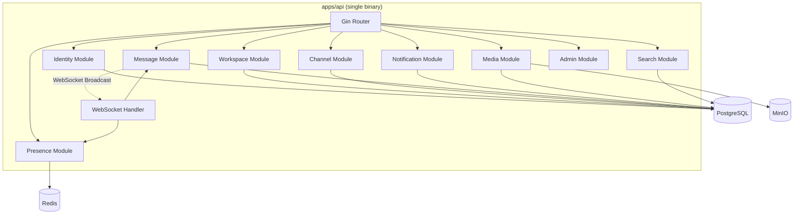
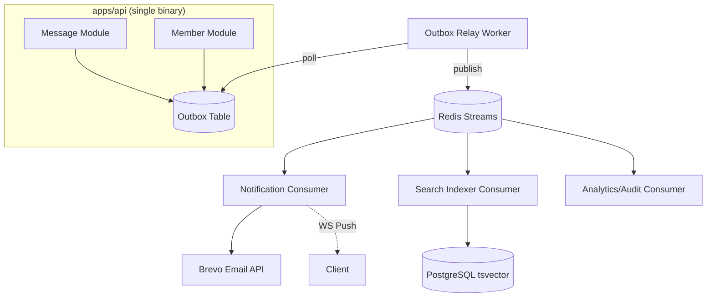
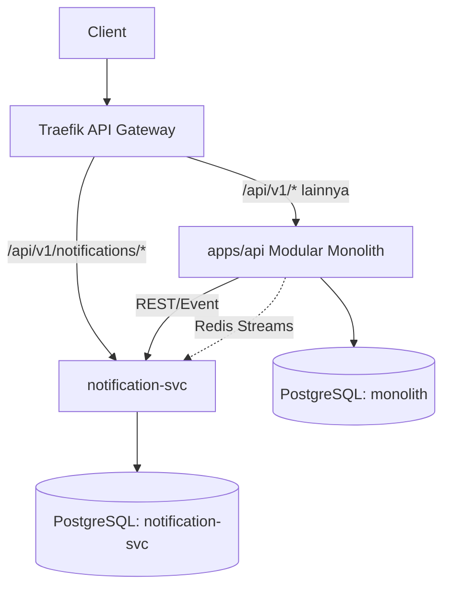
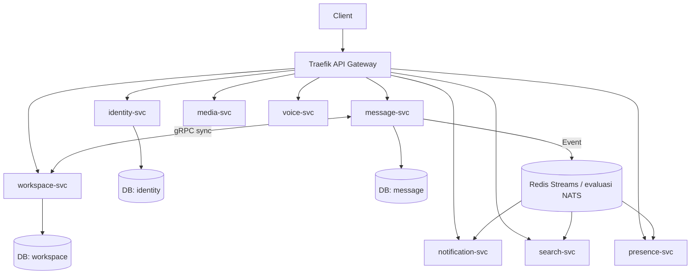
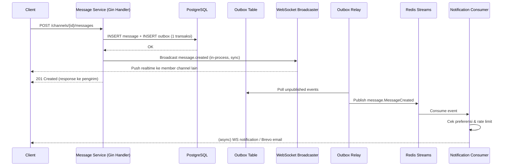
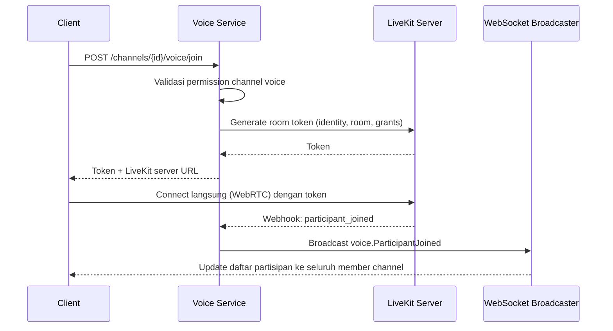

# High Level Design (HLD)
## Project: Nexus — Discord-like Realtime Platform

**Dokumen:** Phase 3 — High Level Design
**Versi:** 1.0.0
**Status:** Draft — Menunggu Persetujuan
**Referensi Wajib:** `01-engineering-playbook.md`, `02-vision-document.md`, `03-adr.md` (v1.1.0), `04-learning-roadmap.md`, `05-prd.md` (v1.1.0), `06-srs.md` (v1.1.0)
**Klasifikasi:** Internal — Source of Truth

---

## 0. Posisi Dokumen Ini

HLD menerjemahkan requirement (SRS) menjadi **struktur sistem**: domain model, batas modul, event yang mengalir antar domain, dan bagaimana komunikasi berevolusi seiring arsitektur bertransformasi dari Modular Monolith ke Microservices. LLD (Phase 4) akan menurunkan setiap keputusan di sini menjadi detail implementasi (struct, interface, algoritma).

---

## 1. Gambaran Arsitektur per Fase

### 1.1 Phase A — Modular Monolith

**Tujuan**: Validasi domain model, seluruh fitur inti berjalan dalam satu deployment unit, boundary domain tegas secara kode (bukan secara proses).

**Learning Objective**: Clean Architecture, DDD Lite, Repository Pattern, dasar WebSocket, dasar Redis.

**Kelebihan**: Deployment sederhana, tidak ada network latency antar domain, debugging mudah (satu proses, satu log stream), transaksi ACID lintas domain masih memungkinkan bila benar-benar dibutuhkan (walau dihindari demi disiplin boundary).

**Kekurangan**: Scaling hanya vertikal atau replikasi seluruh binary (tidak bisa scale Voice terpisah dari Messaging meski beban CPU sangat berbeda); satu bug fatal di satu domain berpotensi mempengaruhi availability domain lain (crash seluruh proses).

**Risiko**: Godaan membuat cross-domain import langsung "demi kecepatan" — dimitigasi `depguard` (Playbook §2.3).

**Trade-off**: Kesederhanaan operasional vs fleksibilitas scaling independen — pada skala NFR awal proyek (10.000 concurrent user pada infrastruktur tunggal yang dikelola baik), trade-off ini **masih sepadan**.

**Kapan Berpindah ke Phase B**: Begitu kebutuhan asynchronous processing nyata (notifikasi, indexing search) mulai memblokir response time operasi utama (mis. mengirim pesan menunggu proses kirim email selesai) — indikator konkret, bukan jadwal waktu.

**Kapan Bertahan**: Selama seluruh operasi masih dapat diselesaikan secara synchronous dalam target response time (§3.1 SRS) tanpa blocking.

### 1.2 Phase B — Event-Driven Modular Monolith

**Tujuan**: Domain event dipublikasikan secara reliable (Outbox Pattern), konsumer asynchronous menangani side-effect (notifikasi, indexing) tanpa memblokir request utama.

**Learning Objective**: Outbox Pattern, Idempotency, Retry Strategy, Redis Streams consumer group.

**Kelebihan**: Response time operasi utama tidak lagi terikat pada kecepatan side-effect (kirim email, indexing); domain lebih loosely coupled (Notification tidak query langsung ke Message).

**Kekurangan**: Eventual consistency (notifikasi/index tidak instan, ada delay milidetik-detik); kompleksitas debugging bertambah (perlu menelusuri Outbox → Relay → Stream → Consumer, bukan satu call stack linear).

**Risiko**: Consumer yang tidak idempotent menyebabkan efek samping ganda saat retry — dimitigasi disiplin FR terkait idempotency key/consumer group ack (Learning Roadmap M12).

**Trade-off**: Latensi side-effect vs reliability & decoupling — diterima karena side-effect (notifikasi, search index) secara inheren tidak butuh instan.

**Kapan Berpindah ke Phase C**: Begitu satu domain (mis. Notification atau Voice/Media) mulai menunjukkan kebutuhan scaling independen nyata (resource profile sangat berbeda dari domain lain, atau butuh deployment cadence berbeda).

**Kapan Bertahan**: Selama seluruh domain masih dapat di-scale bersama secara memadai (replika instance monolith penuh masih cukup murah/efisien).

### 1.3 Phase C — Hybrid Architecture

**Tujuan**: Membuktikan boundary domain yang dirancang sejak Phase A benar-benar dapat diekstraksi dengan friksi minimal.

**Learning Objective**: Strangler Fig Pattern, Bounded Context, Database-per-Service (untuk service yang sudah diekstraksi), gRPC/REST antar proses, Distributed Tracing lintas proses.

**Kelebihan**: Service yang diekstraksi (mis. Notification) dapat di-scale/deploy independen; validasi nyata terhadap kualitas desain boundary domain di Phase A/B.

**Kekurangan**: Kompleksitas operasional meningkat signifikan (dua log stream, dua deployment pipeline, network call baru yang bisa gagal); butuh disiplin observability lintas proses (trace propagation) sejak momen ini.

**Risiko**: Ditemukannya *hidden coupling* yang sebelumnya tidak terlihat dalam monolith (mis. shared transaction, foreign key lintas domain) — inilah nilai pembelajaran utama fase ini, bahkan jika ditemukan masalah.

**Trade-off**: Independent scaling untuk 1-2 domain vs kompleksitas mengelola sistem hybrid (dua "cara berpikir" sekaligus) — hanya dilakukan untuk domain yang benar-benar terbukti butuh (lihat Service Extraction Plan §5).

**Kapan Berpindah ke Phase D**: Ketika ≥ 3 domain kunci sudah diekstraksi DAN kebutuhan orkestrasi lintas service (service discovery dinamis, horizontal scaling otomatis) menjadi kebutuhan nyata bukan hipotetis (selaras ADR-009).

**Kapan Bertahan**: Hybrid adalah **arsitektur akhir yang valid** bila hanya 1-2 domain (mis. Voice/Media) yang benar-benar butuh independensi, sisanya efisien sebagai monolith (Vision Document §7).

### 1.4 Phase D — Full Microservices

**Tujuan**: Setiap domain kunci berdiri sebagai service independen dengan database sendiri, deployment cadence sendiri, tim (hipotetis) sendiri.

**Learning Objective**: Saga Pattern, Database-per-Service penuh, Service Discovery, API Gateway lengkap, gRPC untuk komunikasi sinkron lintas service.

**Kelebihan**: Independent scaling & deployment penuh, kegagalan satu service tidak langsung menjatuhkan seluruh sistem (dengan circuit breaker yang tepat), tim (bila ada) dapat bekerja otonom per service.

**Kekurangan**: Kompleksitas operasional tertinggi (banyak deployment unit, observability lintas puluhan service, konsistensi data lintas service butuh Saga bukan ACID transaction).

**Risiko**: Distributed Monolith bila boundary tidak benar-benar independen (lihat ADR-010); cascading failure bila circuit breaker/timeout tidak didisiplinkan.

**Trade-off**: Fleksibilitas maksimal vs biaya operasional maksimal — **dievaluasi domain per domain** (§5 Service Extraction Plan), bukan diasumsikan seluruh domain harus diekstraksi.

**Kapan Bertahan/Tidak Perlu Ekstraksi Total**: Sesuai Vision §7 — domain yang tidak menunjukkan kebutuhan scaling/deployment independen nyata **tetap di monolith inti**, meski proyek sudah disebut "Phase D".

---

## 2. Domain Design Detail

Setiap domain dijelaskan: Responsibility, Aggregate Root, Entity, Value Object, Domain Event, Repository, Service, Dependency (ke domain lain — idealnya hanya lewat event/port, bukan langsung).

### 2.1 Identity

- **Responsibility**: Registrasi, autentikasi, manajemen sesi/device, refresh token lifecycle.
- **Aggregate Root**: `User`
- **Entity**: `Session` (device/refresh token record)
- **Value Object**: `Email`, `Username`, `PasswordHash`
- **Domain Event**: `identity.UserRegistered`, `identity.UserLoggedIn`, `identity.SessionRevoked`
- **Repository**: `UserRepository`, `SessionRepository`
- **Service**: `AuthService` (register, login, refresh, revoke)
- **Dependency**: Tidak bergantung ke domain lain (domain paling fundamental/independen — kandidat ekstraksi pertama, lihat §5).

### 2.2 Workspace

- **Responsibility**: Kepemilikan workspace, invite management, kategori.
- **Aggregate Root**: `Workspace`
- **Entity**: `Category`, `Invite`
- **Value Object**: `WorkspaceName`, `InviteCode`
- **Domain Event**: `workspace.WorkspaceCreated`, `workspace.WorkspaceDeleted`, `workspace.InviteRedeemed`
- **Repository**: `WorkspaceRepository`, `InviteRepository`
- **Service**: `WorkspaceService`, `InviteService`
- **Dependency**: Membaca identitas `User` via `identity.UserID` (referensi ID saja, bukan JOIN langsung ke tabel `users`).

### 2.3 Member

- **Responsibility**: Keanggotaan user dalam workspace (many-to-many User↔Workspace dengan atribut tambahan: nickname, joined_at).
- **Aggregate Root**: `Member` (didesain sebagai aggregate terpisah dari Workspace agar operasi member-heavy — 100.000 member — tidak membebani aggregate Workspace)
- **Value Object**: `Nickname`
- **Domain Event**: `member.MemberJoined`, `member.MemberLeft`, `member.MemberKicked`, `member.MemberBanned`
- **Repository**: `MemberRepository`
- **Service**: `MembershipService`
- **Dependency**: `workspace_id` (referensi), `user_id` (referensi).

### 2.4 Role & Permission

- **Responsibility**: Definisi role, bitmask permission, assignment role ke member.
- **Aggregate Root**: `Role`
- **Value Object**: `PermissionBitmask`
- **Entity**: `MemberRoleAssignment`
- **Domain Event**: `role.RoleCreated`, `role.RoleAssignedToMember`, `role.RolePermissionChanged`
- **Repository**: `RoleRepository`
- **Service**: `RoleService`, `PermissionResolver` (menerapkan urutan resolusi FR-WS-07)
- **Dependency**: `workspace_id`, `member_id` (referensi).

### 2.5 Channel

- **Responsibility**: CRUD channel (termasuk tipe `dm`), permission override tingkat channel.
- **Aggregate Root**: `Channel`
- **Entity**: `Category` reference, `ChannelPermissionOverride`
- **Value Object**: `ChannelType` (enum: text/voice/video/forum/announcement/dm)
- **Domain Event**: `channel.ChannelCreated`, `channel.ChannelDeleted`, `channel.ChannelPermissionOverrideChanged`
- **Repository**: `ChannelRepository`
- **Service**: `ChannelService`, `ChannelAuthorizationService` (menggabungkan Permission Resolver Workspace ATAU logic DM sederhana — FR-DM-05)
- **Dependency**: `workspace_id` (nullable, untuk DM), `category_id` (nullable).

### 2.6 Message

- **Responsibility**: CRUD pesan, reply, thread, mention, reaction, markdown storage (raw, rendering di frontend).
- **Aggregate Root**: `Message`
- **Entity**: `Reaction`, `Thread`
- **Value Object**: `MessageContent`, `MentionList`
- **Domain Event**: `message.MessageCreated`, `message.MessageEdited`, `message.MessageDeleted`, `message.ReactionAdded`, `message.ReactionRemoved`
- **Repository**: `MessageRepository`, `ReactionRepository`
- **Service**: `MessageService` (termasuk Optimistic Locking check, FR-MSG-09)
- **Dependency**: `channel_id`, `author_id` (referensi).

### 2.7 Attachment

- **Responsibility**: Metadata file yang diunggah, status pemrosesan (pending/processed/failed).
- **Aggregate Root**: `Attachment`
- **Value Object**: `FileMetadata` (size, mime type, checksum)
- **Domain Event**: `attachment.FileUploaded`, `attachment.FileProcessed`, `attachment.FileProcessingFailed`
- **Repository**: `AttachmentRepository`
- **Service**: `UploadService`, `AttachmentProcessingService` (dijalankan via Asynq worker)
- **Dependency**: `message_id` (nullable — attachment bisa diunggah sebelum pesan final terkirim), `uploader_id`.

### 2.8 Notification

- **Responsibility**: Fan-out notifikasi realtime & email, preferensi mute, rate limiting email.
- **Aggregate Root**: `NotificationPreference`
- **Entity**: `NotificationDelivery` (record pengiriman, untuk audit & retry tracking)
- **Domain Event**: `notification.NotificationCreated`, `notification.EmailSent`, `notification.EmailFailed`
- **Repository**: `NotificationPreferenceRepository`, `NotificationDeliveryRepository`
- **Service**: `NotificationDispatchService`
- **Dependency**: **Tidak query langsung** ke Message/Member — menerima payload lengkap dari event (§Learning Roadmap M8).

### 2.9 Presence

- **Responsibility**: Status online/idle/dnd/invisible/offline, TTL-based expiry.
- **Aggregate Root**: Tidak persisten di PostgreSQL (state di Redis) — direpresentasikan sebagai *Read Model* saja bagi domain lain.
- **Value Object**: `PresenceStatus`
- **Domain Event**: `presence.PresenceUpdated`
- **Repository**: `PresenceCache` (Redis-backed, bukan PostgreSQL repository klasik)
- **Service**: `PresenceService`
- **Dependency**: `user_id` (referensi), scoping broadcast berdasar `workspace_id`/`member` bersama (query ke Member domain lewat interface, bukan langsung).

### 2.10 Search

- **Responsibility**: Full-text search pesan, pencarian user/channel/server/attachment.
- **Aggregate Root**: Tidak ada aggregate root sendiri — Search adalah **Read Model terpisah** (CQRS Lightweight) yang di-index dari event domain lain.
- **Domain Event (consumed)**: `message.MessageCreated`, `message.MessageDeleted`, `channel.ChannelCreated`, dst.
- **Repository**: `SearchIndexRepository` (PostgreSQL `tsvector` + `pg_trgm`)
- **Service**: `SearchQueryService`, `SearchIndexerConsumer`
- **Dependency**: Konsumen event dari Message/Channel/Member/Attachment — tidak pernah menulis balik ke domain asal.

### 2.11 Media

- **Responsibility**: Pemrosesan file (thumbnail, ekstraksi metadata, transcoding ringan) — layer pemrosesan di atas Attachment.
- **Aggregate Root**: `MediaProcessingJob`
- **Domain Event**: `media.ThumbnailGenerated`, `media.TranscodingCompleted`
- **Repository**: `MediaJobRepository`
- **Service**: `MediaProcessingService` (worker Asynq, memanggil `ffmpeg`/image library)
- **Dependency**: Konsumen `attachment.FileUploaded`, menghasilkan `media.*` event yang dikonsumsi balik oleh Attachment untuk update status.

### 2.12 Voice & Video

- **Responsibility**: Integrasi LiveKit — pembuatan room, token generation, lifecycle room, sinkronisasi partisipan aktif.
- **Aggregate Root**: `VoiceSession` / `VideoSession`
- **Domain Event**: `voice.ParticipantJoined`, `voice.ParticipantLeft`, `video.ParticipantJoined`
- **Repository**: `VoiceSessionRepository` (state ringan, sebagian besar state ada di LiveKit sendiri)
- **Service**: `LiveKitTokenService`, `VoiceRoomLifecycleService`
- **Dependency**: `channel_id` (tipe voice/video), `member_id`.

### 2.13 Admin

- **Responsibility**: Dashboard metrik, suspend/ban user platform, audit log viewer.
- **Aggregate Root**: `AuditLog` (append-only)
- **Domain Event (consumed)**: hampir seluruh event sensitif lintas domain (untuk audit trail)
- **Repository**: `AuditLogRepository`, `PlatformUserActionRepository`
- **Service**: `AdminModerationService`, `AuditLogService`
- **Dependency**: Konsumen event lintas domain (read-only), plus command langsung ke Identity untuk suspend/ban (satu-satunya domain yang secara sengaja diberi akses command lintas domain, karena sifatnya sebagai *platform authority* — didokumentasikan eksplisit sebagai pengecualian, bukan pola umum).

### 2.14 Direct Message (DM)

- **Responsibility**: Tidak memiliki modul terpisah — **diimplementasikan di dalam domain Channel & Message** (FR-DM-01), dengan tambahan:
- **Entity**: `UserBlock` (`blocker_id`, `blocked_id`)
- **Domain Event**: `dm.UserBlocked`, `dm.UserUnblocked`
- **Repository**: `UserBlockRepository`
- **Service**: `BlockService`, dipanggil oleh `ChannelAuthorizationService` (§2.5) saat validasi pembuatan/pengiriman pesan di channel tipe `dm`.
- **Dependency**: `user_id` pasangan blocker/blocked (referensi ke Identity).

---

## 3. Event Catalog

Format: Event, Publisher, Subscriber, Retry, Idempotency, Dead Letter, Sync/Async.

| Event | Publisher | Subscriber | Retry Strategy | Idempotency | Dead Letter | Sync/Async |
|---|---|---|---|---|---|---|
| `identity.UserRegistered` | Identity | Notification (welcome email, opsional) | 3x exponential backoff | Consumer group ack per event ID | Setelah 3x gagal → dead-letter stream `dlq:identity` | Async |
| `member.MemberJoined` | Member | Notification, Presence, Admin (audit) | 3x | Idempotent by `(event_id)` unique constraint di consumer | `dlq:member` | Async |
| `channel.ChannelCreated` | Channel | Search (index skeleton) | 3x | Idempotent (upsert index by channel_id) | `dlq:channel` | Async |
| `message.MessageCreated` | Message | Notification, Search, Presence (typing clear) | 5x (lebih kritikal untuk UX notifikasi) | Idempotent by `message_id` | `dlq:message` | **Async** untuk notifikasi/index; broadcast realtime ke channel tetap **synchronous** via WebSocket in-process (bukan lewat Outbox — real-time delivery tidak boleh menunggu polling relay) |
| `message.MessageDeleted` | Message | Search (hapus dari index), Notification (batalkan pending notif bila belum terkirim) | 3x | Idempotent (soft-delete flag check sebelum re-index) | `dlq:message` | Async |
| `message.ReactionAdded` | Message | Notification (opsional, sesuai preferensi user) | 3x | Idempotent by `(message_id,user_id,emoji)` | `dlq:message` | Async |
| `presence.PresenceUpdated` | Presence | Client (broadcast langsung), Admin (opsional metrik) | Tidak ada retry (event presence bersifat "state terkini", event lama yang terlewat tidak relevan untuk di-retry) | N/A (state terbaru selalu menang) | Tidak ada DLQ (fire-and-forget by design, TTL Redis sebagai fallback konsistensi) | **Sync** ke client (broadcast langsung), tidak lewat Outbox |
| `attachment.FileUploaded` | Attachment | Media (proses thumbnail/transcode) | 3x | Idempotent by `attachment_id` | `dlq:attachment` | Async |
| `media.ThumbnailGenerated` | Media | Attachment (update status), Client (via WS, update UI) | 3x | Idempotent by `job_id` | `dlq:media` | Async |
| `dm.UserBlocked` | DM (Channel/Block Service) | Notification (batalkan notifikasi pending dari user yang diblokir) | 3x | Idempotent by `(blocker_id, blocked_id)` | `dlq:dm` | Async |

**Kapan Event TIDAK Perlu Dijadikan Event Formal (Outbox)**: Operasi yang bersifat *ephemeral* dan tidak butuh durability (typing indicator, presence heartbeat) **tidak** melalui Outbox Pattern — cukup broadcast langsung (in-process untuk Phase A/B, Redis Pub/Sub untuk multi-instance) karena kehilangan satu event typing/presence tidak berdampak signifikan (event berikutnya akan segera menggantikannya).

**Kapan Synchronous vs Asynchronous**: Operasi yang **harus** terlihat oleh pengirim dalam response langsung (mis. pesan berhasil terkirim → tampil di UI pengirim) bersifat synchronous di jalur utama; efek samping (notifikasi ke pihak lain, indexing) bersifat asynchronous via Outbox — pembagian ini konsisten sepanjang seluruh Event Catalog di atas.

---

## 4. Inter-Service Communication per Fase

| Fase | Mekanisme Utama | Kapan Dipakai | Trade-off |
|---|---|---|---|
| A | In-process function call | Seluruh komunikasi antar domain (lewat interface/port, bukan call langsung struct) | Tercepat, tapi tidak ada isolasi failure |
| B | In-process call + Redis Streams (Outbox) | Sinkron untuk request-response dalam monolith; asynchronous untuk domain event | Menambah eventual consistency untuk side-effect, tanpa mengorbankan latensi jalur utama |
| C | REST/gRPC (sinkron, monolith↔service terekstraksi) + Redis Streams (event lintas proses) | REST untuk request sederhana (mis. Notification query preference dari Workspace); gRPC dipertimbangkan bila latency-sensitive dan payload terstruktur kompleks | REST lebih sederhana untuk dipelajari & debug (human-readable), gRPC lebih efisien tapi menambah kompleksitas tooling (protobuf codegen) — pemilihan per-case, bukan default tunggal |
| D | REST (client-facing via Gateway) + gRPC (internal service-to-service sinkron) + Event (asynchronous lintas service) | REST tetap untuk komunikasi client↔gateway (sesuai spesifikasi awal proyek: REST sebagai layer utama); gRPC untuk internal berlatensi rendah; Event untuk yang genuinely asynchronous | Kombinasi ketiganya memberi tooling yang tepat untuk tiap kebutuhan, namun menambah permukaan yang harus dipahami tim (diterima sebagai bagian Learning Objective) |

**Prinsip Konsisten**: REST tetap menjadi **komunikasi utama** sesuai instruksi proyek; gRPC hanya dipakai untuk komunikasi internal service-to-service yang terbukti butuh performa lebih tinggi dari REST (bukan default untuk semua komunikasi internal); Event (Redis Streams) hanya untuk yang genuinely asynchronous — **tidak dipakai sebagai pengganti request-response yang butuh jawaban langsung** (selaras batasan eksplisit di spesifikasi awal proyek).

---

## 5. Service Extraction Plan

| Urutan | Modul | Layak Dipisah? | Alasan | Benefit | Risiko | Kompleksitas | Prioritas |
|---|---|---|---|---|---|---|---|
| 1 | **Identity** | Ya | Paling independen (§2.1), tidak ada dependency masuk dari domain lain kecuali referensi ID | Auth dapat di-scale terpisah, mempermudah rate limiting login terpusat | Rendah — domain paling matang & stabil untuk dipisah lebih dulu | Rendah | Tinggi |
| 2 | **Notification** | Ya | Sudah didesain loosely coupled sejak Phase B (menerima payload lengkap, tidak query balik) | Beban kirim email/push tidak mengganggu performa monolith saat volume notifikasi tinggi | Rendah — sudah terbukti decoupled sejak Milestone 8 | Rendah | Tinggi |
| 3 | **Presence** | Ya | State-nya sudah di Redis (bukan PostgreSQL monolith), secara alami sudah "terpisah" datanya | Scaling presence independen penting saat concurrent user tinggi (banyak koneksi WS) | Sedang — perlu memastikan scoping broadcast (per-workspace) tetap efisien lintas proses | Sedang | Tinggi |
| 4 | **Media** | Ya | Beban kerja CPU-intensive (transcoding) sangat berbeda dari domain lain — kandidat kuat untuk resource allocation terpisah | Scaling worker transcoding independen dari API utama | Sedang — perlu memastikan staging area/Asynq queue tetap terhubung baik | Sedang | Tinggi |
| 5 | **Search** | Ya | Read model terpisah (CQRS Lite) — secara desain sudah tidak menulis balik ke domain lain | Query search berat tidak membebani database utama | Sedang — sinkronisasi index (lag antara event dan searchability) perlu dipantau | Sedang | Sedang |
| 6 | **Message** | Ya | Volume data terbesar & traffic tertinggi — kandidat utama untuk scaling independen | Manfaat scaling terbesar untuk NFR 10.000 concurrent users | Tinggi — paling banyak dependency masuk (Notification, Search, Presence semua terhubung ke Message events) | Tinggi | Sedang |
| 7 | **Workspace/Member/Role/Channel** | Dipertimbangkan, namun **kandidat kuat untuk TETAP monolith** | Domain-domain ini saling terkait sangat erat (permission resolution butuh Role+Member+Channel dalam satu konteks otorisasi) — ekstraksi paksa berisiko tinggi menjadi Distributed Monolith | Jika diekstraksi: independent scaling untuk beban member-heavy | **Sangat Tinggi** — permission resolution lintas 4 sub-domain akan butuh banyak network round-trip bila dipisah, jelas melanggar prinsip "minimize inter-service chatting" | Sangat Tinggi | **Rendah (sengaja ditunda/dipertimbangkan tetap monolith)** |
| 8 | **Voice** | Ya | Beban real-time media (LiveKit) sangat berbeda profil resource-nya | Scaling voice session independen dari traffic chat teks | Sedang | Sedang | Tinggi |
| 9 | **Video** | Ya | Sama seperti Voice, dengan beban bandwidth lebih tinggi | Sama seperti Voice | Sedang | Sedang | Tinggi |

**Urutan final direkomendasikan**: **Identity → Notification → Presence → Media → Search → Message → Voice → Video**, dengan **Workspace/Member/Role/Channel dipertahankan sebagai inti monolith** kecuali ditemukan bukti konkret (di Milestone 13/17) bahwa ekstraksinya sepadan.

**Rationale urutan**: dimulai dari domain paling independen dan paling rendah risiko (Identity, Notification) untuk membangun kepercayaan dan pengalaman proses ekstraksi, sebelum mencoba domain berisiko lebih tinggi (Message, Voice/Video) yang volumenya besar namun dependency-nya juga lebih kompleks.

---

## 6. Sequence Diagram — Alur Kunci

### 6.1 Kirim Pesan (Synchronous path + Asynchronous side-effect)

### 6.2 Join Voice Channel

---

## Ringkasan Keputusan

1. Evolusi arsitektur 4 fase (A-D) didesain dengan kriteria transisi **konkret dan terukur**, bukan berdasarkan jadwal waktu semata.
2. **15 domain** (termasuk DM sebagai bagian Channel/Message) didefinisikan lengkap dengan aggregate root, event, repository, service, dan dependency minimal.
3. Event Catalog membedakan tegas kapan **synchronous** (broadcast realtime in-process) vs **asynchronous** (Outbox → Redis Streams) — broadcast realtime tidak pernah menunggu Outbox Relay.
4. Service Extraction Plan merekomendasikan **Workspace/Member/Role/Channel tetap sebagai inti monolith** bahkan di Phase D — keputusan yang secara sadar menantang asumsi "semua harus jadi microservice".

## Trade-off yang Diterima

- Presence dan typing indicator tidak melalui Outbox Pattern (fire-and-forget) — kehilangan event individual dapat diterima karena state terbaru selalu menggantikan yang lama.
- Admin domain diberi pengecualian akses command lintas domain (ke Identity untuk suspend/ban) — pelanggaran sadar terhadap prinsip loose coupling demi kebutuhan *platform authority* yang inheren lintas domain.

## Risiko Arsitektur

- Message domain memiliki dependency masuk terbanyak (Notification, Search, Presence) — ekstraksinya (urutan ke-6) berisiko paling tinggi menimbulkan masalah koordinasi event lintas service; perlu perhatian ekstra saat Milestone 17.
- Permission resolution (Role/Member/Channel) yang sengaja dipertahankan monolith perlu tetap dijaga performanya seiring volume member bertambah (100.000/workspace) — dipantau di Milestone 11 (Optimization).

## Technical Debt yang Sengaja Diterima

- Keputusan final REST vs gRPC untuk tiap pasangan service di Phase D belum di-detailkan per endpoint — akan dituntaskan saat Milestone 13/17 tiba, berdasarkan data nyata (bukan spekulasi sekarang).
- Circuit breaker/retry policy spesifik antar service belum didetailkan angka presisinya — akan dibahas di Low Level Design (Phase 4).

## Hal yang Perlu Dikonfirmasi Sebelum Lanjut ke Fase Berikutnya

1. Apakah rekomendasi **mempertahankan Workspace/Member/Role/Channel sebagai inti monolith** (tidak diekstraksi) dapat diterima sebagai keputusan default, dengan opsi dievaluasi ulang di Milestone 17 bila ada bukti kuat sebaliknya?
2. Apakah Event Catalog §3 (khususnya keputusan presence/typing sebagai fire-and-forget tanpa Outbox) sudah sesuai ekspektasi?
3. Lanjut ke **Phase 4 — Low Level Design (LLD)**?

---

## Changelog

| Versi | Tanggal | Perubahan |
|---|---|---|
| 1.0.0 | Draft awal | Dokumen pertama Phase 3, mencakup arsitektur 4 fase, 15 domain (termasuk DM), Event Catalog, Inter-Service Communication, Service Extraction Plan, dan 2 sequence diagram kunci |
