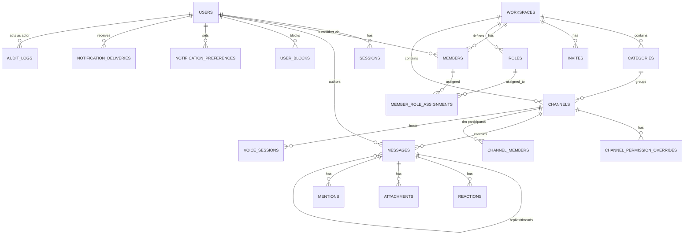

# Database Design
## Project: Nexus — Discord-like Realtime Platform

**Dokumen:** Phase 5 — Database Design
**Versi:** 1.0.0
**Status:** Draft — Menunggu Persetujuan
**Referensi Wajib:** `01-engineering-playbook.md` (§7.6 Konvensi DB), `03-adr.md` (ADR-003 sqlc, ADR-006 Redis Streams), `06-srs.md`, `07-hld.md`, `08-lld.md`
**Klasifikasi:** Internal — Source of Truth

---

## 0. Posisi Dokumen Ini

Dokumen ini mendefinisikan skema fisik PostgreSQL untuk Phase A (Modular Monolith) — seluruh tabel berada dalam satu database `nexus_dev`/`nexus_prod`. Saat Service Extraction (Phase C/D) berlangsung, tabel-tabel yang dimiliki domain yang diekstraksi akan **dipindahkan** ke database terpisah (Database-per-Service, ADR-010) — dicatat sebagai anotasi "Kandidat Extraction DB" pada tabel yang relevan, mengacu ke Service Extraction Plan (HLD §5).

---

## 1. Entity Relationship Diagram (ERD)



---

## 2. DDL per Domain

### 2.1 Identity

```sql
-- 20260101000001_create_users_table.sql
CREATE TABLE users (
    id             UUID PRIMARY KEY DEFAULT uuid_generate_v7(),
    email          CITEXT NOT NULL UNIQUE,      -- CITEXT: case-insensitive (Playbook §7.7 rationale)
    username       CITEXT NOT NULL UNIQUE,
    display_name   VARCHAR(64) NOT NULL,
    password_hash  TEXT NOT NULL,               -- Argon2id encoded string
    avatar_url     TEXT,
    is_suspended   BOOLEAN NOT NULL DEFAULT FALSE,
    is_banned      BOOLEAN NOT NULL DEFAULT FALSE,
    created_at     TIMESTAMPTZ NOT NULL DEFAULT now(),
    updated_at     TIMESTAMPTZ NOT NULL DEFAULT now(),
    deleted_at     TIMESTAMPTZ
);
CREATE INDEX idx_users_deleted_at ON users (deleted_at) WHERE deleted_at IS NOT NULL;

-- 20260101000002_create_sessions_table.sql
CREATE TABLE sessions (
    id                  UUID PRIMARY KEY DEFAULT uuid_generate_v7(),
    user_id             UUID NOT NULL REFERENCES users(id) ON DELETE CASCADE,
    refresh_token_hash  TEXT NOT NULL UNIQUE,   -- SHA-256 hash, bukan plaintext (§3.8 SRS)
    user_agent          TEXT,
    ip_address          INET,
    status              VARCHAR(16) NOT NULL DEFAULT 'active', -- active | revoked
    expires_at          TIMESTAMPTZ NOT NULL,
    created_at          TIMESTAMPTZ NOT NULL DEFAULT now()
);
CREATE INDEX idx_sessions_user_id_status ON sessions (user_id, status);
```

**Kandidat Extraction DB**: `identity-svc` (urutan ekstraksi pertama, HLD §5).

### 2.2 Workspace, Member, Role, Permission

```sql
-- 20260101000010_create_workspaces_table.sql
CREATE TABLE workspaces (
    id          UUID PRIMARY KEY DEFAULT uuid_generate_v7(),
    owner_id    UUID NOT NULL REFERENCES users(id),
    name        VARCHAR(100) NOT NULL,
    icon_url    TEXT,
    created_at  TIMESTAMPTZ NOT NULL DEFAULT now(),
    updated_at  TIMESTAMPTZ NOT NULL DEFAULT now(),
    deleted_at  TIMESTAMPTZ
);

-- 20260101000011_create_categories_table.sql
CREATE TABLE categories (
    id            UUID PRIMARY KEY DEFAULT uuid_generate_v7(),
    workspace_id  UUID NOT NULL REFERENCES workspaces(id) ON DELETE CASCADE,
    name          VARCHAR(100) NOT NULL,
    position      INT NOT NULL DEFAULT 0,
    created_at    TIMESTAMPTZ NOT NULL DEFAULT now()
);
CREATE INDEX idx_categories_workspace_id ON categories (workspace_id);

-- 20260101000012_create_invites_table.sql
CREATE TABLE invites (
    id            UUID PRIMARY KEY DEFAULT uuid_generate_v7(),
    workspace_id  UUID NOT NULL REFERENCES workspaces(id) ON DELETE CASCADE,
    code          VARCHAR(16) NOT NULL UNIQUE,
    created_by    UUID NOT NULL REFERENCES users(id),
    max_uses      INT,                  -- NULL = unlimited (FR-WS-06)
    use_count     INT NOT NULL DEFAULT 0,
    expires_at    TIMESTAMPTZ,          -- NULL = tidak kedaluwarsa
    created_at    TIMESTAMPTZ NOT NULL DEFAULT now()
);

-- 20260101000013_create_members_table.sql
-- Aggregate terpisah dari workspaces (HLD §2.3) — di-desain untuk skala 100.000 row/workspace
CREATE TABLE members (
    id            UUID PRIMARY KEY DEFAULT uuid_generate_v7(),
    workspace_id  UUID NOT NULL REFERENCES workspaces(id) ON DELETE CASCADE,
    user_id       UUID NOT NULL REFERENCES users(id) ON DELETE CASCADE,
    nickname      VARCHAR(64),
    joined_at     TIMESTAMPTZ NOT NULL DEFAULT now(),
    UNIQUE (workspace_id, user_id)
);
CREATE INDEX idx_members_workspace_id ON members (workspace_id);
CREATE INDEX idx_members_user_id ON members (user_id);

-- 20260101000014_create_roles_table.sql
CREATE TABLE roles (
    id            UUID PRIMARY KEY DEFAULT uuid_generate_v7(),
    workspace_id  UUID NOT NULL REFERENCES workspaces(id) ON DELETE CASCADE,
    name          VARCHAR(100) NOT NULL,
    permission_bitmask BIGINT NOT NULL DEFAULT 0, -- FR-WS-03
    position      INT NOT NULL DEFAULT 0,          -- FR-WS-04, resolusi hierarki
    is_everyone   BOOLEAN NOT NULL DEFAULT FALSE,   -- role @everyone (FR-WS-02), tidak dapat dihapus (enforced di service layer)
    created_at    TIMESTAMPTZ NOT NULL DEFAULT now()
);
CREATE INDEX idx_roles_workspace_id_position ON roles (workspace_id, position DESC);

-- 20260101000015_create_member_role_assignments_table.sql
CREATE TABLE member_role_assignments (
    member_id  UUID NOT NULL REFERENCES members(id) ON DELETE CASCADE,
    role_id    UUID NOT NULL REFERENCES roles(id) ON DELETE CASCADE,
    PRIMARY KEY (member_id, role_id)
);
CREATE INDEX idx_mra_role_id ON member_role_assignments (role_id);
```

**Kandidat Extraction DB**: **Tetap inti monolith** sesuai rekomendasi HLD §5 (risiko ekstraksi sangat tinggi karena saling terkait erat dalam resolusi permission).

### 2.3 Channel (termasuk DM)

```sql
-- 20260101000020_create_channels_table.sql
CREATE TABLE channels (
    id            UUID PRIMARY KEY DEFAULT uuid_generate_v7(),
    workspace_id  UUID REFERENCES workspaces(id) ON DELETE CASCADE, -- NULL untuk tipe 'dm' (FR-DM-01)
    category_id   UUID REFERENCES categories(id) ON DELETE SET NULL,
    type          VARCHAR(16) NOT NULL CHECK (type IN ('text','voice','video','forum','announcement','dm')),
    name          VARCHAR(100),           -- NULL diperbolehkan untuk channel dm (tidak butuh nama)
    participant_key CHAR(64),             -- hash SHA-256 partisipan ter-sort, HANYA untuk type='dm' (FR-DM-02, LLD §2.5)
    position      INT NOT NULL DEFAULT 0,
    created_at    TIMESTAMPTZ NOT NULL DEFAULT now(),
    deleted_at    TIMESTAMPTZ,
    CONSTRAINT chk_workspace_scoped_or_dm CHECK (
        (type = 'dm' AND workspace_id IS NULL) OR (type != 'dm' AND workspace_id IS NOT NULL)
    )
);
CREATE INDEX idx_channels_workspace_id ON channels (workspace_id) WHERE workspace_id IS NOT NULL;
-- Constraint unik HANYA berlaku untuk channel dm 1-on-1 (partial unique index)
CREATE UNIQUE INDEX uidx_channels_dm_participant_key ON channels (participant_key) WHERE type = 'dm' AND participant_key IS NOT NULL;

-- 20260101000021_create_channel_permission_overrides_table.sql
CREATE TABLE channel_permission_overrides (
    id           UUID PRIMARY KEY DEFAULT uuid_generate_v7(),
    channel_id   UUID NOT NULL REFERENCES channels(id) ON DELETE CASCADE,
    role_id      UUID REFERENCES roles(id) ON DELETE CASCADE,   -- salah satu dari role_id/member_id diisi (XOR, enforced service layer)
    member_id    UUID REFERENCES members(id) ON DELETE CASCADE,
    allow_bitmask BIGINT NOT NULL DEFAULT 0,
    deny_bitmask  BIGINT NOT NULL DEFAULT 0,
    CONSTRAINT chk_override_target CHECK (
        (role_id IS NOT NULL AND member_id IS NULL) OR (role_id IS NULL AND member_id IS NOT NULL)
    )
);
CREATE INDEX idx_cpo_channel_role ON channel_permission_overrides (channel_id, role_id) WHERE role_id IS NOT NULL;
CREATE INDEX idx_cpo_channel_member ON channel_permission_overrides (channel_id, member_id) WHERE member_id IS NOT NULL;

-- 20260101000022_create_channel_members_table.sql
-- Khusus untuk DM (partisipan grup DM, FR-DM-03), channel workspace-scoped tidak memakai tabel ini
-- (keanggotaan channel workspace ditentukan oleh permission, bukan membership eksplisit)
CREATE TABLE channel_members (
    channel_id  UUID NOT NULL REFERENCES channels(id) ON DELETE CASCADE,
    user_id     UUID NOT NULL REFERENCES users(id) ON DELETE CASCADE,
    joined_at   TIMESTAMPTZ NOT NULL DEFAULT now(),
    PRIMARY KEY (channel_id, user_id)
);

-- 20260101000023_create_user_blocks_table.sql
CREATE TABLE user_blocks (
    blocker_id  UUID NOT NULL REFERENCES users(id) ON DELETE CASCADE,
    blocked_id  UUID NOT NULL REFERENCES users(id) ON DELETE CASCADE,
    created_at  TIMESTAMPTZ NOT NULL DEFAULT now(),
    PRIMARY KEY (blocker_id, blocked_id)
);
```

### 2.4 Message

```sql
-- 20260101000030_create_messages_table.sql
CREATE TABLE messages (
    id             UUID PRIMARY KEY DEFAULT uuid_generate_v7(),
    channel_id     UUID NOT NULL REFERENCES channels(id) ON DELETE CASCADE,
    author_id      UUID NOT NULL REFERENCES users(id),
    reply_to_id    UUID REFERENCES messages(id) ON DELETE SET NULL,
    thread_root_id UUID REFERENCES messages(id) ON DELETE SET NULL, -- FR-MSG-04
    content        TEXT NOT NULL,
    version        INT NOT NULL DEFAULT 0,      -- Optimistic Locking (FR-MSG-09)
    search_vector  TSVECTOR,                    -- diisi via trigger, lihat §4
    edited_at      TIMESTAMPTZ,
    deleted_at     TIMESTAMPTZ,
    created_at     TIMESTAMPTZ NOT NULL DEFAULT now()
) PARTITION BY RANGE (created_at); -- lihat §5 Partitioning Recommendation

-- Composite index utama untuk cursor pagination (LLD §2.2)
CREATE INDEX idx_messages_channel_created_id ON messages (channel_id, created_at DESC, id DESC) WHERE deleted_at IS NULL;
CREATE INDEX idx_messages_thread_root ON messages (thread_root_id) WHERE thread_root_id IS NOT NULL;
CREATE INDEX idx_messages_search_vector ON messages USING GIN (search_vector);

-- 20260101000031_create_reactions_table.sql
CREATE TABLE reactions (
    message_id  UUID NOT NULL REFERENCES messages(id) ON DELETE CASCADE,
    user_id     UUID NOT NULL REFERENCES users(id) ON DELETE CASCADE,
    emoji       VARCHAR(32) NOT NULL,
    created_at  TIMESTAMPTZ NOT NULL DEFAULT now(),
    PRIMARY KEY (message_id, user_id, emoji)  -- FR-MSG-06
);

-- 20260101000032_create_mentions_table.sql
CREATE TABLE mentions (
    message_id      UUID NOT NULL REFERENCES messages(id) ON DELETE CASCADE,
    mentioned_user_id  UUID REFERENCES users(id) ON DELETE CASCADE,
    mentioned_role_id  UUID REFERENCES roles(id) ON DELETE CASCADE,
    CONSTRAINT chk_mention_target CHECK (
        (mentioned_user_id IS NOT NULL AND mentioned_role_id IS NULL) OR
        (mentioned_user_id IS NULL AND mentioned_role_id IS NOT NULL)
    )
);
CREATE INDEX idx_mentions_user ON mentions (mentioned_user_id) WHERE mentioned_user_id IS NOT NULL;

-- 20260101000033_create_read_receipts_table.sql
-- Per-user per-channel, BUKAN per-pesan (FR-PRES-04, menghindari eksplosi row)
CREATE TABLE read_receipts (
    user_id             UUID NOT NULL REFERENCES users(id) ON DELETE CASCADE,
    channel_id          UUID NOT NULL REFERENCES channels(id) ON DELETE CASCADE,
    last_read_message_id UUID REFERENCES messages(id),
    updated_at          TIMESTAMPTZ NOT NULL DEFAULT now(),
    PRIMARY KEY (user_id, channel_id)
);
```

**Kandidat Extraction DB**: `message-svc` (urutan ekstraksi ke-6, HLD §5 — risiko tertinggi karena dependency masuk terbanyak).

### 2.5 Attachment & Media

```sql
-- 20260101000040_create_attachments_table.sql
CREATE TABLE attachments (
    id              UUID PRIMARY KEY DEFAULT uuid_generate_v7(),
    message_id      UUID REFERENCES messages(id) ON DELETE CASCADE, -- nullable (FR §2.7 HLD, bisa diunggah sebelum pesan final)
    uploader_id     UUID NOT NULL REFERENCES users(id),
    file_name       VARCHAR(255) NOT NULL,
    mime_type       VARCHAR(127) NOT NULL,
    size_bytes      BIGINT NOT NULL,
    bucket          VARCHAR(64) NOT NULL,   -- 'nexus-attachments' | 'nexus-avatars'
    object_key       TEXT NOT NULL,          -- path/key di MinIO
    status          VARCHAR(16) NOT NULL DEFAULT 'pending', -- pending | processed | failed
    checksum_sha256 CHAR(64),
    created_at      TIMESTAMPTZ NOT NULL DEFAULT now()
);
CREATE INDEX idx_attachments_message_id ON attachments (message_id) WHERE message_id IS NOT NULL;

-- 20260101000041_create_media_processing_jobs_table.sql
CREATE TABLE media_processing_jobs (
    id              UUID PRIMARY KEY DEFAULT uuid_generate_v7(),
    attachment_id   UUID NOT NULL REFERENCES attachments(id) ON DELETE CASCADE,
    job_type        VARCHAR(32) NOT NULL, -- thumbnail | metadata_extraction | transcode
    status          VARCHAR(16) NOT NULL DEFAULT 'queued',
    result_metadata JSONB,
    error_message   TEXT,
    created_at      TIMESTAMPTZ NOT NULL DEFAULT now(),
    completed_at    TIMESTAMPTZ
);
```

### 2.6 Notification

```sql
-- 20260101000050_create_notification_preferences_table.sql
CREATE TABLE notification_preferences (
    user_id      UUID NOT NULL REFERENCES users(id) ON DELETE CASCADE,
    scope_type   VARCHAR(16) NOT NULL, -- 'workspace' | 'channel'
    scope_id     UUID NOT NULL,
    level        VARCHAR(16) NOT NULL DEFAULT 'all', -- all | mentions_only | none (FR-NOTIF-03)
    PRIMARY KEY (user_id, scope_type, scope_id)
);

-- 20260101000051_create_notification_deliveries_table.sql
CREATE TABLE notification_deliveries (
    id            UUID PRIMARY KEY DEFAULT uuid_generate_v7(),
    recipient_id  UUID NOT NULL REFERENCES users(id),
    channel       VARCHAR(16) NOT NULL, -- 'websocket' | 'email'
    status        VARCHAR(16) NOT NULL DEFAULT 'pending', -- pending | sent | failed
    payload       JSONB NOT NULL,
    sent_at       TIMESTAMPTZ,
    created_at    TIMESTAMPTZ NOT NULL DEFAULT now()
);
CREATE INDEX idx_notif_deliveries_recipient ON notification_deliveries (recipient_id, created_at DESC);
```

**Kandidat Extraction DB**: `notification-svc` (urutan ekstraksi ke-2).

### 2.7 Voice/Video

```sql
-- 20260101000060_create_voice_sessions_table.sql
CREATE TABLE voice_sessions (
    id             UUID PRIMARY KEY DEFAULT uuid_generate_v7(),
    channel_id     UUID NOT NULL REFERENCES channels(id) ON DELETE CASCADE,
    livekit_room_name VARCHAR(128) NOT NULL,
    started_at     TIMESTAMPTZ NOT NULL DEFAULT now(),
    ended_at       TIMESTAMPTZ
);

CREATE TABLE voice_participants (
    voice_session_id  UUID NOT NULL REFERENCES voice_sessions(id) ON DELETE CASCADE,
    user_id           UUID NOT NULL REFERENCES users(id),
    joined_at         TIMESTAMPTZ NOT NULL DEFAULT now(),
    left_at           TIMESTAMPTZ,
    PRIMARY KEY (voice_session_id, user_id, joined_at)
);
```

### 2.8 Event Backbone (Outbox & Idempotency)

```sql
-- 20260101000070_create_outbox_events_table.sql
CREATE TABLE outbox_events (
    id             UUID PRIMARY KEY DEFAULT uuid_generate_v7(),
    aggregate_type VARCHAR(64) NOT NULL, -- 'message', 'member', 'channel', dst.
    aggregate_id   UUID NOT NULL,
    event_type     VARCHAR(128) NOT NULL, -- 'message.MessageCreated', dst.
    event_version  INT NOT NULL DEFAULT 1,
    payload        JSONB NOT NULL,
    published_at   TIMESTAMPTZ,
    created_at     TIMESTAMPTZ NOT NULL DEFAULT now()
);
-- Index untuk relay worker: fetch batch unpublished secepat mungkin
CREATE INDEX idx_outbox_unpublished ON outbox_events (created_at) WHERE published_at IS NULL;

-- 20260101000071_create_processed_events_table.sql
-- Idempotency tracking untuk consumer (LLD §2.7)
CREATE TABLE processed_events (
    event_id      UUID PRIMARY KEY,
    consumer_name VARCHAR(64) NOT NULL,
    processed_at  TIMESTAMPTZ NOT NULL DEFAULT now()
);
```

### 2.9 Admin & Audit

```sql
-- 20260101000080_create_audit_logs_table.sql
-- Append-only (§3.6 SRS) — TIDAK ADA updated_at/deleted_at secara desain
CREATE TABLE audit_logs (
    id           UUID PRIMARY KEY DEFAULT uuid_generate_v7(),
    actor_id     UUID NOT NULL REFERENCES users(id),
    action       VARCHAR(64) NOT NULL,
    target_type  VARCHAR(64) NOT NULL,
    target_id    UUID NOT NULL,
    metadata     JSONB,
    ip_address   INET,
    created_at   TIMESTAMPTZ NOT NULL DEFAULT now()
);
CREATE INDEX idx_audit_logs_actor_created ON audit_logs (actor_id, created_at DESC);
CREATE INDEX idx_audit_logs_target ON audit_logs (target_type, target_id);
```

---

## 3. Relationship Summary

| Relasi | Kardinalitas | Catatan |
|---|---|---|
| User ↔ Workspace | Many-to-Many via `members` | Member sebagai aggregate terpisah (bukan tabel junction murni) karena membawa atribut (`nickname`, `joined_at`) |
| Member ↔ Role | Many-to-Many via `member_role_assignments` | Satu member bisa punya banyak role |
| Workspace ↔ Channel | One-to-Many | `workspace_id` nullable untuk channel `dm` |
| Channel ↔ Message | One-to-Many | Termasuk channel `dm` (memakai infrastruktur Message yang sama, sesuai rationale PRD §6.9) |
| Message ↔ Message (self-referencing) | reply_to_id & thread_root_id | Dua foreign key self-reference terpisah untuk dua konsep berbeda (reply vs thread) |
| Message ↔ Attachment | One-to-Many | `message_id` nullable (upload dapat mendahului pengiriman pesan) |
| User ↔ User (Block) | Many-to-Many via `user_blocks` | Directional (blocker → blocked, bukan simetris) |

---

## 4. Full Text Search Setup

```sql
-- Trigger otomatis mengisi search_vector setiap INSERT/UPDATE content
CREATE OR REPLACE FUNCTION messages_search_vector_update() RETURNS trigger AS $$
BEGIN
    NEW.search_vector := to_tsvector('simple', COALESCE(NEW.content, ''));
    RETURN NEW;
END;
$$ LANGUAGE plpgsql;

CREATE TRIGGER trg_messages_search_vector
BEFORE INSERT OR UPDATE OF content ON messages
FOR EACH ROW EXECUTE FUNCTION messages_search_vector_update();
```

**Rationale konfigurasi `simple`** (bukan `indonesian`/`english`): sesuai FR-SRCH-01, konten campuran bahasa (Indonesia + Inggris + istilah teknis) lebih aman memakai konfigurasi netral tanpa stemming agresif yang bisa salah untuk bahasa campuran — trade-off yang diterima, dievaluasi ulang bila data riil menunjukkan mayoritas jelas satu bahasa.

Untuk pencarian nama user/channel/workspace (FR-SRCH-02/03) yang toleran typo ringan:

```sql
CREATE EXTENSION IF NOT EXISTS pg_trgm;
CREATE INDEX idx_users_username_trgm ON users USING GIN (username gin_trgm_ops);
CREATE INDEX idx_channels_name_trgm ON channels USING GIN (name gin_trgm_ops) WHERE name IS NOT NULL;
CREATE INDEX idx_workspaces_name_trgm ON workspaces USING GIN (name gin_trgm_ops);
```

---

## 5. Partitioning Recommendation

**Tabel `messages`** diberi `PARTITION BY RANGE (created_at)` sejak DDL awal (§2.4), namun partisi aktual **dibuat bertahap** (tidak seluruh partisi masa depan dibuat sekaligus — YAGNI):

```sql
CREATE TABLE messages_y2026m01 PARTITION OF messages
    FOR VALUES FROM ('2026-01-01') TO ('2026-02-01');
CREATE TABLE messages_y2026m02 PARTITION OF messages
    FOR VALUES FROM ('2026-02-01') TO ('2026-03-01');
-- dst., dibuat otomatis via scheduled job (pg_partman direkomendasikan untuk otomasi, dievaluasi di Deployment Architecture)
```

**Kapan Partitioning Benar-Benar Bermanfaat**: begitu volume mendekati puluhan juta baris (indikator konkret, bukan asumsi) — sebelum itu, partitioning menambah kompleksitas query planner tanpa manfaat nyata (index B-Tree biasa pada tabel non-partisi kecil-menengah sudah sangat efisien). **Rekomendasi**: siapkan skema partisi sejak awal (migrasi sudah mendukung), namun evaluasi aktivasi penuh (jumlah partisi bertambah otomatis) di Milestone 11 (Optimization) berdasarkan data nyata.

Tabel lain yang dipertimbangkan partisi di masa depan bila volume besar: `audit_logs` (partition by `created_at`, retensi 1 tahun sesuai §3.6 SRS cocok dengan drop-partition-lama sebagai strategi retensi efisien), `notification_deliveries`.

---

## 6. Migration Strategy

Mengikuti konvensi §7.7 Playbook (timestamp-based naming, append-only). Tambahan khusus proyek ini:

- Migrasi tabel `messages` (partitioned table) memerlukan strategi khusus: **tidak bisa** menambah kolom dengan `DEFAULT` non-null secara langsung pada tabel besar tanpa downtime (locking); memakai pola **expand-contract**: tambah kolom nullable dulu → backfill bertahap (batch) → tambah constraint `NOT NULL` setelah backfill selesai.
- Setiap migrasi yang mengubah tabel dengan volume besar (`messages`, `audit_logs`) wajib diuji dengan **estimasi waktu eksekusi di staging** sebelum diterapkan ke production (bagian dari Checklist Release, Playbook §14).

---

## 7. Query Optimization — Catatan Kunci

| Query Pattern | Index yang Dipakai | Catatan |
|---|---|---|
| List pesan per channel (cursor pagination) | `idx_messages_channel_created_id` (composite) | Index ini **wajib** composite (bukan dua index terpisah) agar PostgreSQL dapat memakai satu index scan untuk filter + sort sekaligus |
| Resolusi permission (member roles) | `idx_roles_workspace_id_position` | `position DESC` di index mendukung urutan resolusi langsung tanpa sort tambahan di query time |
| Search full-text pesan | `idx_messages_search_vector` (GIN) | Dikombinasikan dengan filter `channel_id` — pertimbangkan composite/partial index tambahan bila EXPLAIN ANALYZE menunjukkan GIN scan tidak cukup selektif tanpa filter channel terlebih dahulu (dievaluasi nyata di Milestone 11) |
| Cek member list (100.000/workspace) | `idx_members_workspace_id` | Wajib selalu dipaginasi cursor-based (SRS FR-WS-08), tidak pernah `SELECT * FROM members WHERE workspace_id = ...` tanpa limit |
| Cek DM uniqueness | `uidx_channels_dm_participant_key` (partial unique) | Constraint di level database, bukan hanya application check (LLD §2.5) |

---

## Ringkasan Keputusan

1. Skema mengikuti penuh konvensi Playbook §7.6 (UUID v7, `timestamptz`, `version` untuk optimistic locking, soft delete `deleted_at`).
2. Tabel `messages` dipartisi sejak DDL awal (skema siap), namun aktivasi partisi penuh ditunda hingga volume nyata membutuhkan (YAGNI, dievaluasi di Milestone 11).
3. Full-text search memakai konfigurasi `simple` (bukan bahasa spesifik) untuk mengakomodasi konten multi-bahasa.
4. Constraint DM uniqueness (`participant_key`) ditegakkan di level database (partial unique index), bukan hanya application-level check.

## Trade-off yang Diterima

- Konfigurasi `simple` untuk full-text search mengorbankan kualitas stemming (kata berimbuhan tidak match sebaik konfigurasi bahasa spesifik) demi keamanan terhadap konten multi-bahasa.
- Partisi tabel `messages` dibuat manual bertahap di awal (bukan otomatis penuh via `pg_partman` sejak hari pertama) — kesederhanaan awal diterima, otomasi penuh dipertimbangkan saat Deployment Architecture.

## Risiko Arsitektur

- `channel_permission_overrides` dengan constraint XOR (`role_id` vs `member_id`) memerlukan disiplin aplikasi yang konsisten — constraint database mencegah data invalid, namun logic query builder harus selalu tahu kolom mana yang relevan dicek.
- Tabel `messages` sebagai partitioned table sejak awal menambah sedikit kompleksitas migrasi rutin (setiap migrasi struktural harus mempertimbangkan seluruh partisi) — trade-off yang diterima demi kesiapan skala di masa depan.

## Technical Debt yang Sengaja Diterima

- Index GIN untuk full-text search belum dioptimasi dengan composite/partial index spesifik per channel — akan dievaluasi ulang di Milestone 11 berdasarkan `EXPLAIN ANALYZE` nyata.
- Strategi migrasi expand-contract untuk tabel besar (§6) baru didefinisikan sebagai prinsip, belum ada tooling otomatis untuk backfill batch — akan dibangun sesuai kebutuhan nyata saat migrasi besar pertama diperlukan.

## Hal yang Perlu Dikonfirmasi Sebelum Lanjut ke Fase Berikutnya

1. Apakah skema `messages` sebagai **partitioned table sejak awal** (meski partisi aktual dibuat bertahap) dapat diterima, mengingat ini menambah sedikit kompleksitas operasional migrasi rutin?
2. Apakah konfigurasi full-text search `simple` (bukan `indonesian`) dapat diterima sebagai baseline?
3. Lanjut ke **Phase 6 — API Specification**?

---

## Changelog

| Versi | Tanggal | Perubahan |
|---|---|---|
| 1.0.0 | Draft awal | Dokumen pertama Phase 5: ERD, DDL lengkap seluruh domain (termasuk DM), full-text search setup, partitioning recommendation, migration strategy, dan catatan query optimization |
