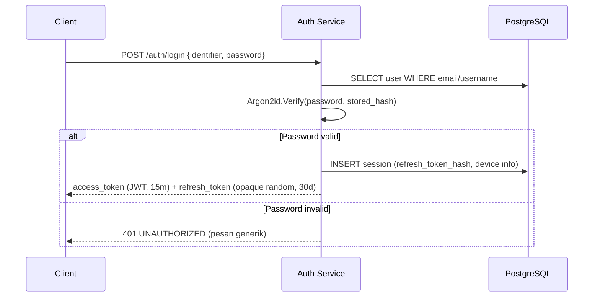
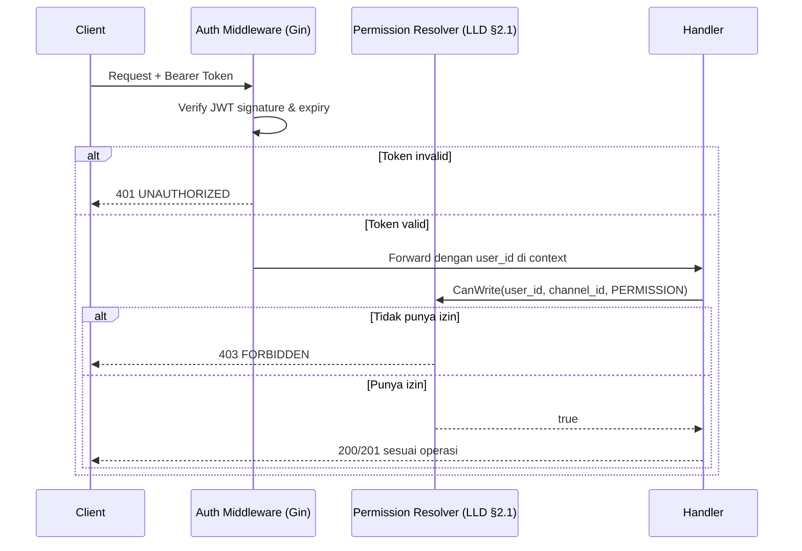

# Security Design
## Project: Nexus — Discord-like Realtime Platform

**Dokumen:** Phase 7 — Security Design
**Versi:** 1.0.0
**Status:** Draft — Menunggu Persetujuan
**Referensi Wajib:** `06-srs.md` (§3.4-3.11), `08-lld.md`, `10-api-specification.md`
**Klasifikasi:** Internal — Source of Truth

---

## 0. Posisi Dokumen Ini

Dokumen ini menuntaskan seluruh keputusan keamanan yang sebelumnya dicatat sebagai "final ditentukan di Security Design" (Argon2id parameter, refresh token storage HttpOnly vs localStorage, CAPTCHA activation, GeoIP). Threat Model disusun memakai pendekatan **STRIDE** per komponen kunci.

---

## 1. Threat Model (STRIDE per Komponen)

| Komponen | Spoofing | Tampering | Repudiation | Info Disclosure | DoS | Elevation of Privilege |
|---|---|---|---|---|---|---|
| **Auth (Login/Register)** | Credential stuffing, brute force | — | Login tanpa audit trail | User enumeration lewat pesan error berbeda | Login endpoint dibanjiri request | — |
| **JWT/Session** | Token dicuri (XSS/network) dipakai penyerang | Token dimodifikasi (bila secret bocor) | — | Payload JWT tidak boleh berisi data sensitif | — | Token expired dipakai ulang (replay) |
| **Permission/Authorization** | — | Bitmask dimanipulasi via request tidak sah | Perubahan role tanpa audit log | Permission check bocor via response error yang membedakan "tidak ada" vs "tidak punya akses" | — | **Privilege escalation**: member biasa memanipulasi request untuk mendapat permission admin |
| **WebSocket** | Koneksi WS tanpa autentikasi valid | Client mengirim event palsu (mis. `message.created` langsung tanpa lewat REST) | — | Broadcast bocor ke channel yang tidak seharusnya diakses user | Koneksi WS dibuka massal (connection flood) | — |
| **Upload** | — | File berbahaya menyamar sebagai tipe aman | — | Path traversal via nama file, akses attachment user lain | Upload file besar berulang menghabiskan storage/bandwidth | — |
| **DM/Block** | — | — | — | Kebocoran keberadaan channel DM sebelum validasi block (dicatat sebagai risiko di API Spec) | — | — |

---

## 2. Authentication Flow (Final)

**Keputusan Final Parameter Argon2id** (menuntaskan debt SRS FR-AUTH-02):

| Parameter | Nilai | Rationale |
|---|---|---|
| Memory | 46 MiB | Dinaikkan dari baseline OWASP 19 MiB — proyek memiliki kapasitas server yang cukup dan login bukan operasi frekuensi sangat tinggi, sehingga margin keamanan tambahan diambil |
| Iterations | 3 | |
| Parallelism | 2 | Disesuaikan asumsi minimal 2 vCPU pada environment produksi awal |

**Keputusan Final Refresh Token Storage**: **HttpOnly, Secure, SameSite=Strict Cookie** dipilih dibanding localStorage.

| Aspek | HttpOnly Cookie | localStorage |
|---|---|---|
| Risiko XSS mencuri token | Rendah — JavaScript tidak dapat membaca cookie HttpOnly | Tinggi — XSS apapun langsung dapat membaca token |
| Risiko CSRF | Ada, namun dimitigasi (§6) | Tidak ada risiko CSRF (token dikirim manual via header) |
| Kesesuaian dengan PWA (requirement proyek) | Baik, cookie tetap bekerja dalam konteks PWA modern | Baik juga |
| Keputusan | **Dipilih** — mitigasi XSS dianggap lebih kritikal daripada CSRF (yang lebih mudah dimitigasi sistematis) | Ditolak |

**Konsekuensi**: endpoint `POST /auth/refresh` **wajib** dilindungi CSRF token (double-submit cookie pattern, §6), sesuai catatan bersyarat di SRS §3.10 yang kini menjadi keputusan final.

---

## 3. Authorization Flow

**Prinsip Keras**: Authorization **selalu** dicek di backend (service layer), tidak pernah hanya mengandalkan UI hiding di frontend (konsisten dengan Learning Roadmap Milestone 3 & mitigasi Elevation of Privilege di §1).

---

## 4. Attack Surface

| Permukaan | Eksposur | Mitigasi |
|---|---|---|
| REST API publik | Internet-facing via Traefik | TLS wajib, rate limiting berlapis, validasi input ketat |
| WebSocket endpoint | Internet-facing | Autentikasi wajib saat handshake (token di query param/header saat upgrade), validasi origin |
| MinIO (object storage) | **Tidak** diekspos langsung ke internet — hanya diakses lewat backend (presigned URL bila diperlukan akses langsung, dengan masa berlaku singkat) | Bucket policy private by default |
| PostgreSQL/Redis | Internal network only (Docker network / Kubernetes NetworkPolicy Phase D), tidak ada port terekspos publik | Firewall/network isolation |
| LiveKit | Endpoint terpisah, diakses via token yang di-generate backend (§Learning Roadmap M9) | Token berumur pendek, scoped ke room tertentu |
| Admin Panel | Path terpisah, permission Platform Admin | Pertimbangan tambahan: IP allowlist untuk akses admin di masa depan (dicatat sebagai opsi, tidak wajib di awal — YAGNI) |

---

## 5. OWASP Top 10 — Mapping Mitigasi

| # | Risiko | Mitigasi di Nexus |
|---|---|---|
| A01 | Broken Access Control | Permission Resolver terpusat (LLD §2.1), authorization selalu di backend, audit log untuk aksi sensitif |
| A02 | Cryptographic Failures | Argon2id untuk password, TLS in-transit, refresh token disimpan sebagai hash |
| A03 | Injection | sqlc (parameterized query by design, ADR-003) — tidak ada string concatenation SQL manual; validasi input via `go-playground/validator` |
| A04 | Insecure Design | Threat modeling eksplisit (dokumen ini), Decision Framework di setiap ADR |
| A05 | Security Misconfiguration | Environment variable terpisah per environment, secret tidak pernah hardcoded (Playbook §18), `.env.example` tanpa nilai asli |
| A06 | Vulnerable Components | `govulncheck` wajib di CI (Playbook §6.3), dependency di-review berkala |
| A07 | Identification & Authentication Failures | Rate limiting login progresif, refresh token rotation, device management |
| A08 | Software & Data Integrity Failures | CI pipeline dengan lint/test/security scan wajib sebelum merge (Playbook §13) |
| A09 | Security Logging & Monitoring Failures | Structured logging (Zap) + audit log terpisah + OpenTelemetry (Milestone 15) |
| A10 | Server-Side Request Forgery (SSRF) | Validasi ketat URL embed link preview (FR-MSG-08) — hanya fetch metadata dari domain yang di-allowlist atau lewat sandboxed fetcher dengan timeout ketat dan larangan akses ke IP privat/internal |

---

## 6. CSRF Protection (Final)

Karena refresh token disimpan sebagai HttpOnly Cookie (§2), endpoint `POST /auth/refresh` menerapkan **double-submit cookie pattern**:

1. Saat login berhasil, server juga mengirim cookie kedua non-HttpOnly `csrf_token` (readable JavaScript).
2. Client menyertakan nilai tersebut di header `X-CSRF-Token` saat memanggil `/auth/refresh`.
3. Server memvalidasi header cocok dengan cookie — request tanpa header yang cocok ditolak `403 FORBIDDEN`.

Endpoint REST lain (memakai `Authorization: Bearer` header, bukan cookie otomatis) **tidak** memerlukan CSRF token tambahan karena secara inheren tidak dipicu otomatis oleh browser tanpa sepengetahuan JavaScript aplikasi.

---

## 7. WebSocket Security

- **Autentikasi saat handshake**: token JWT dikirim sebagai query parameter (`?token=...`) karena WebSocket API browser tidak mendukung custom header saat handshake — token divalidasi sebelum upgrade diterima, koneksi ditolak (`4001 Unauthorized` custom close code) bila invalid.
- **Validasi Origin**: header `Origin` divalidasi terhadap domain aplikasi yang diizinkan, mencegah koneksi WS dari domain pihak ketiga.
- **Autorisasi per-event**: setiap event yang mengubah state (mis. `typing.start`) tetap divalidasi permission channel di server — client tidak dipercaya untuk hanya mengirim event ke channel yang berhak diaksesnya.
- **Rate limiting koneksi**: maksimal koneksi WS aktif per user dibatasi (mis. 5 device bersamaan) untuk mitigasi connection flood dari satu akun.
- **Payload size limit**: pesan WebSocket masuk dibatasi ukuran (mis. 8 KB per frame) untuk mencegah DoS lewat frame raksasa (Learning Roadmap Milestone 5).

---

## 8. Secrets Management

- Seluruh secret (JWT signing key, database password, Brevo API key, MinIO access key, LiveKit API secret) disimpan sebagai environment variable, **tidak pernah** hardcoded (Playbook §18).
- Phase A-C (Docker Compose): secret dikelola via `.env` file yang **tidak** di-commit, di-inject ke container saat deploy.
- Phase D (Kubernetes): migrasi ke **Kubernetes Secret** (dasar) atau External Secret Operator terhubung ke vault (opsional lanjutan, dicatat sebagai opsi masa depan bila kompleksitas proyek berkembang — tidak wajib di awal, YAGNI).
- Rotasi secret (JWT signing key khususnya) direncanakan sebagai prosedur manual terdokumentasi (bukan otomatis) untuk skala proyek ini — dengan mekanisme dual-key sesaat (`kid` di JWT header) agar token lama tetap valid selama masa transisi rotasi.

---

## 9. Rate Limiting Strategy (Final, menuntaskan SRS §3.5 & LLD §2.8)

Diterapkan **berlapis**:

1. **Traefik middleware** (kasar, per-IP): proteksi awal terhadap volumetrik traffic sebelum mencapai aplikasi.
2. **Aplikasi (Redis sliding window, LLD §2.8)**: presisi per-user per-aksi sesuai tabel §3.5 SRS.
3. **Database connection pool limit**: mencegah request yang lolos rate limit tetap membanjiri koneksi database (`pgxpool.MaxConns` dikonfigurasi eksplisit, bukan default tak terbatas).

---

## 10. Spam & Abuse Protection (Final)

- **CAPTCHA**: dikonfirmasi **tidak diaktifkan sejak awal** (sesuai keputusan YAGNI di SRS), namun kode diarsitektur agar dapat diaktifkan reaktif (feature flag `ENABLE_CAPTCHA_REGISTRATION`) tanpa perubahan struktural bila pola registrasi bot terdeteksi di production.
- **GeoIP untuk security alert**: dikonfirmasi **tidak dipakai**, heuristik IP sederhana (perubahan IP signifikan dibanding histori login) sudah cukup sesuai keputusan SRS §6.

---

## Ringkasan Keputusan

1. **Argon2id final**: memory 46 MiB, iterations 3, parallelism 2.
2. **Refresh token**: HttpOnly Secure SameSite=Strict Cookie (bukan localStorage), dengan konsekuensi wajib CSRF protection di endpoint refresh (double-submit cookie).
3. Threat Model STRIDE mengidentifikasi risiko spesifik per komponen, seluruhnya memiliki mitigasi konkret yang dipetakan ke OWASP Top 10.
4. WebSocket diautentikasi via token di query param saat handshake, dengan validasi Origin dan otorisasi per-event tetap di server (tidak pernah mempercayai client).
5. CAPTCHA dan GeoIP tetap tidak diaktifkan (final, sesuai SRS), namun diarsitektur agar dapat diaktifkan reaktif tanpa refactor besar.

## Trade-off yang Diterima

- HttpOnly Cookie menambah kompleksitas CSRF protection dibanding localStorage, namun mitigasi risiko XSS-based token theft dianggap lebih kritikal untuk aplikasi chat dengan konten user-generated (markdown rendering) yang secara inheren rentan XSS bila sanitasi gagal.
- Parameter Argon2id yang lebih berat (46 MiB) meningkatkan beban CPU/memori saat login dibanding baseline OWASP minimum — diterima karena login bukan operasi frekuensi tinggi dan margin keamanan lebih diutamakan.

## Risiko Arsitektur

- SSRF mitigation untuk link preview embed (FR-MSG-08, OWASP A10) memerlukan komponen fetcher khusus yang belum didesain detail — dicatat sebagai item Low Level Design tambahan saat fitur embed diimplementasikan (prioritas "Should", dapat ditunda).
- Rotasi JWT signing key manual berisiko human error bila tidak didokumentasikan sebagai runbook yang jelas — akan dituntaskan di Engineering Documentation (Learning Roadmap Milestone 18/Deployment Architecture).

## Technical Debt yang Sengaja Diterima

- IP allowlist untuk Admin Panel dicatat sebagai opsi, belum menjadi requirement wajib — dapat diaktifkan reaktif bila kebutuhan keamanan platform meningkat.
- External Secret Operator/Vault tidak diimplementasikan di awal Phase D — Kubernetes Secret dasar dianggap cukup untuk skala proyek belajar, dicatat sebagai upgrade path bila diperlukan.

## Hal yang Perlu Dikonfirmasi Sebelum Lanjut ke Fase Berikutnya

1. Apakah keputusan **HttpOnly Cookie untuk refresh token** (dibanding localStorage yang lebih sederhana diimplementasikan namun rentan XSS) dapat diterima, mengingat ini menambah kompleksitas CSRF protection?
2. Apakah parameter Argon2id final (memory 46 MiB, iterations 3, parallelism 2) dapat diterima sebagai baseline, dengan pemahaman akan divalidasi ulang lewat benchmark nyata di Milestone 11?
3. Lanjut ke **Phase 8 — Deployment Architecture**?

---

## Changelog

| Versi | Tanggal | Perubahan |
|---|---|---|
| 1.0.0 | Draft awal | Dokumen pertama Phase 7: Threat Model STRIDE, Authentication/Authorization Flow final, OWASP Top 10 mapping, WebSocket Security, dan penuntasan seluruh debt keamanan dari SRS/API Spec |
