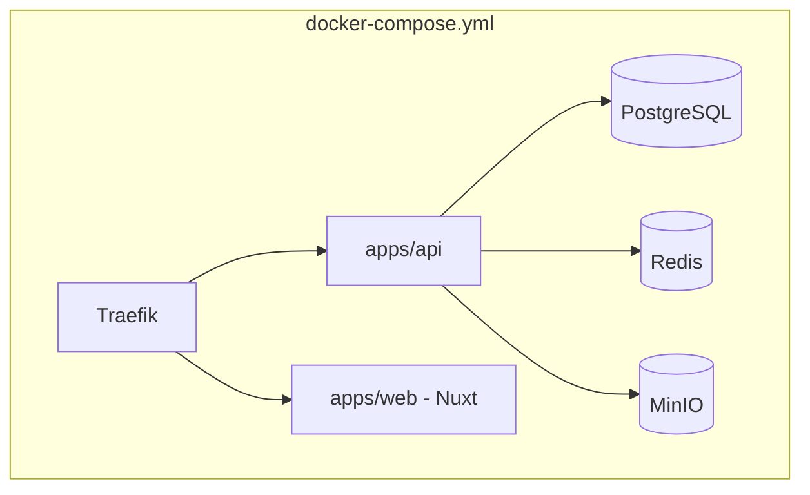
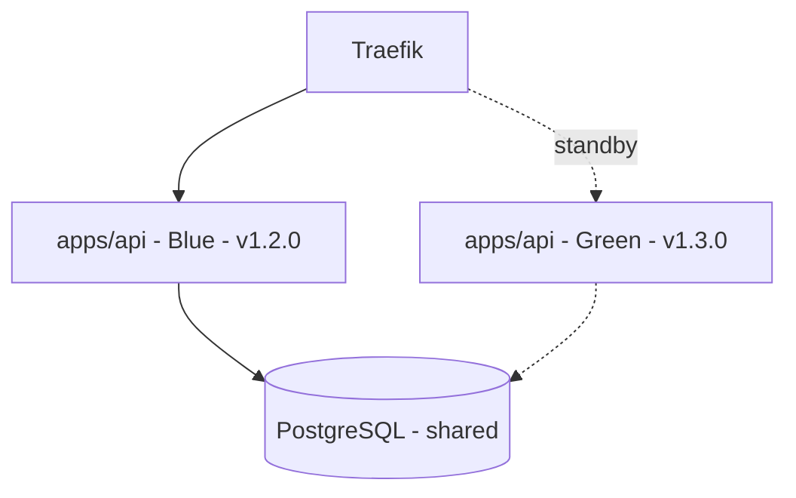
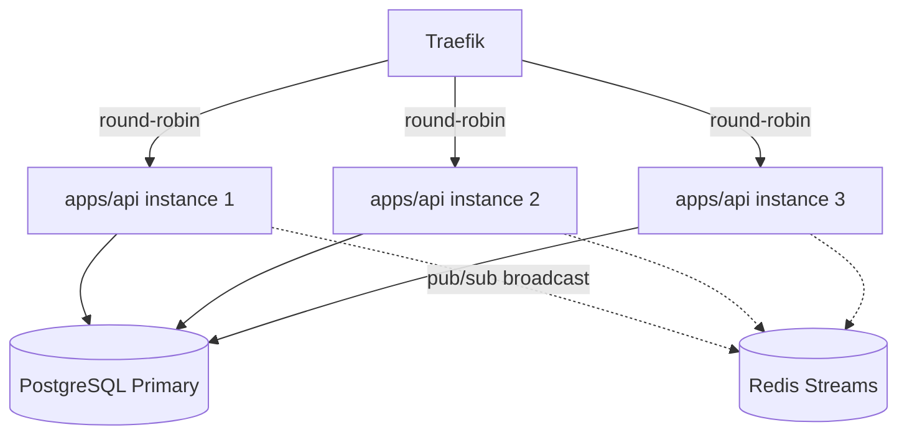
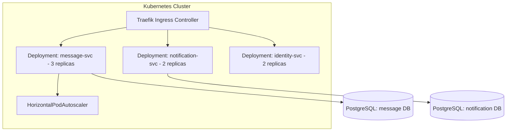
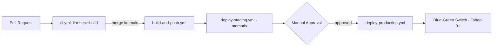

# Deployment Architecture

## Project: Nexus — Discord-like Realtime Platform

**Dokumen:** Phase 8 — Deployment Architecture
**Versi:** 1.0.0
**Status:** Draft — Menunggu Persetujuan
**Referensi Wajib:** `01-engineering-playbook.md` (§6 CI/CD), `03-adr.md` (ADR-008 Traefik, ADR-009 Docker Compose→Kubernetes), `06-srs.md` (§3.3-3.4 Availability/DR), `11-security-design.md` (§8 Secrets Management)
**Klasifikasi:** Internal — Source of Truth

---

## 0. Posisi Dokumen Ini

Dokumen ini merinci **evolusi deployment 5 tahap** yang sudah diprinsipkan di Engineering Playbook, menjadi konfigurasi konkret: topologi container, strategi zero-downtime, dan runbook operasional dasar.

---

## 1. Tahap 1 — Docker Compose (Lokal & Development)



**Kapan dipakai**: Development lokal dan lingkungan belajar awal (Phase A-B arsitektur).

**Kelebihan**: Setup instan (`docker compose up`), representatif terhadap production topology (bukan `go run` telanjang), seluruh dependency (PostgreSQL, Redis, MinIO) terisolasi dan reproducible.

**Kekurangan**: Single-host — tidak ada high availability; restart container = downtime singkat.

**Risiko**: Volume data lokal tidak di-backup otomatis — perlu disiplin manual saat development (tidak kritikal karena data development, bukan production).

**Trade-off**: Kesederhanaan penuh vs tidak ada jaminan availability — diterima karena tahap ini murni untuk development/testing, bukan melayani pengguna nyata.

### Konfigurasi Kunci

```yaml
# docker-compose.yml (ringkasan struktur)
services:
  traefik:
    image: traefik:v3.1
    command:
      - "--providers.docker=true"
      - "--entrypoints.web.address=:80"
    ports: ["80:80", "8080:8080"] # dashboard Traefik di 8080 (dev only)
    volumes: ["/var/run/docker.sock:/var/run/docker.sock:ro"]

  api:
    build: ./apps/api
    labels:
      - "traefik.http.routers.api.rule=PathPrefix(`/api`)"
    environment:
      - NEXUS_API_DB_DSN=${NEXUS_API_DB_DSN}
      - NEXUS_API_REDIS_ADDR=${NEXUS_API_REDIS_ADDR}
      - NEXUS_API_MINIO_ENDPOINT=${NEXUS_API_MINIO_ENDPOINT}
      - NEXUS_API_BREVO_API_KEY=${NEXUS_API_BREVO_API_KEY}
    depends_on: [postgres, redis, minio]

  postgres:
    image: postgres:18
    volumes: ["pgdata:/var/lib/postgresql/data"]

  redis:
    image: redis:7-alpine

  minio:
    image: minio/minio:latest
    command: server /data --console-address ":9001"
    volumes: ["miniodata:/data"]

volumes:
  pgdata:
  miniodata:
```

---

## 2. Tahap 2 — Single VPS (Production Awal)

**Kapan dipakai**: Production pertama proyek, selaras Phase A/B arsitektur, target Availability **99.0%** (SRS §3.3).

**Topologi**: Docker Compose yang sama seperti Tahap 1, dijalankan di satu VPS (mis. 4 vCPU/8GB RAM sebagai baseline awal), dengan tambahan:

- TLS otomatis via Traefik + Let's Encrypt (ADR-008).
- Backup terjadwal (cron job harian: `pg_dump` + rsync ke storage sekunder, sesuai SRS §3.4).
- Monitoring dasar (Milestone 15 belum matang penuh di tahap ini, namun health check endpoint sudah wajib berfungsi).

**Kelebihan**: Biaya rendah, operasional sederhana, cukup untuk memvalidasi seluruh fitur produk dengan traffic terbatas.

**Kekurangan**: Single point of failure — restart/deploy = downtime singkat (belum zero-downtime); tidak ada redundansi hardware.

**Risiko**: VPS mati/crash = seluruh sistem down hingga manual intervention.

**Trade-off**: Biaya & kompleksitas minimal vs availability terbatas — diterima untuk skala awal, dengan rencana eksplisit naik ke Tahap 3 begitu deployment mulai lebih sering (kebutuhan zero-downtime menjadi nyata).

**Kapan Naik ke Tahap 3**: Begitu frekuensi deployment meningkat (mis. > 1x/minggu) sehingga downtime singkat berulang mulai terasa mengganggu, ATAU begitu proyek ingin mempraktikkan Learning Objective Blue-Green secara nyata (Milestone 16).

---

## 3. Tahap 3 — Blue-Green Deployment



**Mekanisme**:

1. Environment `Green` (versi baru) dijalankan paralel dengan `Blue` (versi aktif), keduanya terhubung ke database yang sama (migrasi database harus backward-compatible selama masa transisi — expand-contract, Database Design §6).
2. Health check `Green` dipastikan lolos (`/readyz`).
3. Traefik dynamic configuration (label Docker) dialihkan dari `Blue` ke `Green` — **tanpa restart Traefik**, cukup update label & Traefik otomatis mendeteksi (native dynamic config, ADR-008).
4. `Blue` (versi lama) dibiarkan berjalan singkat (grace period, mis. 5 menit) untuk menyelesaikan request in-flight (graceful shutdown, LLD §3), baru dimatikan.
5. Bila `Green` bermasalah, rollback instan dengan mengarahkan kembali ke `Blue` (yang masih berjalan).

**Kapan dipakai**: Begitu kematangan deployment membutuhkan **zero-downtime** (Availability target naik ke **99.5%**, SRS §3.3).

**Kelebihan**: Zero-downtime deployment sungguhan, rollback instan, environment baru diverifikasi sebelum menerima traffic penuh.

**Kekurangan**: Butuh resource 2x lipat sesaat (dua environment berjalan paralel); memerlukan disiplin migrasi database backward-compatible.

**Risiko**: Migrasi database yang tidak backward-compatible (mis. drop kolom yang masih dipakai `Blue`) akan merusak strategi ini — wajib melalui expand-contract migration (Database Design §6, Playbook §5.3).

**Trade-off**: Resource ganda sesaat vs zero-downtime — sepadan mengingat biaya VPS tambahan sesaat jauh lebih murah daripada downtime yang mengganggu pengalaman belajar/demo proyek.

**Kapan Naik ke Tahap 4**: Begitu satu VPS tunggal (meski dengan Blue-Green) sudah mencapai batas kapasitas vertikal (CPU/memory API instance mendekati saturasi pada beban puncak) — indikator dari metrik Prometheus (Milestone 15), bukan asumsi.

---

## 4. Tahap 4 — Horizontal Scaling (Multi-Instance, Single/Few VPS)



**Mekanisme**: Beberapa instance `apps/api` berjalan paralel (di VPS yang sama atau beberapa VPS), Traefik melakukan load balancing round-robin. **Kebutuhan krusial**: broadcast WebSocket lintas instance (risiko terbuka sejak HLD §Risiko) **wajib diselesaikan** di tahap ini — setiap instance subscribe ke Redis Streams/Pub-Sub agar broadcast pesan sampai ke koneksi WebSocket yang di-hold instance manapun.

**Kapan dipakai**: Begitu concurrent user mendekati batas kapasitas satu instance API (indikator konkret dari load test Milestone 11/18), selaras kebutuhan NFR 10.000 concurrent users.

**Kelebihan**: Scaling horizontal genuine untuk request HTTP; redundansi (satu instance crash, instance lain tetap melayani).

**Kekurangan**: Kompleksitas broadcast WebSocket lintas instance harus diselesaikan (tidak lagi bisa in-process broadcast sederhana, LLD §2.9).

**Risiko**: Bila strategi broadcast lintas instance tidak diimplementasikan dengan benar sebelum horizontal scaling diaktifkan, user bisa kehilangan pesan realtime (pesan hanya sampai ke koneksi di instance yang sama dengan pengirim).

**Trade-off**: Kompleksitas tambahan (Redis sebagai broadcast layer wajib, bukan opsional) vs kemampuan menangani traffic lebih tinggi — **wajib** dilakukan sebelum tahap ini diaktifkan, bukan sesudahnya.

**Kapan Naik ke Tahap 5**: Begitu kebutuhan resiliency melampaui kapasitas beberapa VPS tunggal (butuh redundansi across hardware fisik/availability zone berbeda) — selaras Phase D arsitektur (Full Microservices dengan banyak service independen).

---

## 5. Tahap 5 — Multi-Node (Kubernetes)



**Mekanisme**: Transisi dari Docker Compose ke Kubernetes (ADR-009), setiap service (hasil ekstraksi Phase C/D) menjadi Deployment terpisah dengan `HorizontalPodAutoscaler` berdasarkan CPU/custom metric, `Rolling Update` sebagai strategi default Kubernetes (`maxSurge`/`maxUnavailable` dikonfigurasi eksplisit).

**Kapan dipakai**: Phase D arsitektur (Full Microservices), selaras ADR-009 — **tidak diaktifkan sebelum minimal 3 service independen** benar-benar berdiri (HLD §Kapan Berpindah ke Phase D).

**Kelebihan**: Orkestrasi otomatis (self-healing, auto-scaling), rolling update native, multi-node = redundansi hardware sungguhan.

**Kekurangan**: Kompleksitas operasional tertinggi — kurva belajar YAML/CRD, butuh observability lebih matang untuk debug lintas Pod.

**Risiko**: Kompleksitas Kubernetes yang tidak proporsional bila diaktifkan terlalu dini (kesalahan umum, ADR-009) — **secara sengaja ditunda** hingga kebutuhan nyata.

**Trade-off**: Kapabilitas orkestrasi penuh vs overhead operasional — diterima **hanya** pada skala di mana manfaatnya jelas melebihi biayanya.

---

## 6. CI/CD Pipeline per Tahap



- **Tahap 1-2**: `deploy-production.yml` melakukan `docker compose pull && docker compose up -d` sederhana (downtime singkat dapat diterima).
- **Tahap 3+**: `deploy-production.yml` menjalankan skrip Blue-Green (deploy Green → health check → switch label Traefik → grace period → matikan Blue).
- **Tahap 5**: `deploy-production.yml` menjalankan `kubectl apply`/Helm upgrade, Kubernetes menangani Rolling Update secara native.

---

## 7. Environment & Secret Management

| Tahap | Environment Management                                                                                 | Secret Management                                                                                                            |
| ----- | ------------------------------------------------------------------------------------------------------ | ---------------------------------------------------------------------------------------------------------------------------- |
| 1-2   | `.env` file per environment (`.env.dev`, `.env.prod`), tidak di-commit                                 | Manual, disimpan di password manager tim/personal, di-inject manual ke VPS                                                   |
| 3-4   | Sama seperti di atas, ditambah validasi `.env` lengkap sebagai bagian Checklist Release (Playbook §14) | Sama, dengan disiplin rotasi berkala (Security Design §8)                                                                    |
| 5     | ConfigMap (non-sensitif) + Kubernetes Secret (sensitif) per service                                    | Kubernetes Secret sebagai baseline; External Secret Operator sebagai upgrade path opsional (Security Design §8, tidak wajib) |

---

## 8. Resource Allocation Awal (Estimasi Baseline)

| Komponen                | CPU (baseline)                          | Memory (baseline)                       | Catatan                                                                                                  |
| ----------------------- | --------------------------------------- | --------------------------------------- | -------------------------------------------------------------------------------------------------------- |
| apps/api (per instance) | 0.5-1 vCPU                              | 256-512 MB                              | Divalidasi ulang di Milestone 11 dengan profiling nyata                                                  |
| PostgreSQL              | 1-2 vCPU                                | 1-2 GB                                  | Meningkat signifikan seiring volume `messages` bertambah                                                 |
| Redis                   | 0.25-0.5 vCPU                           | 256 MB - 1 GB                           | Memory bertambah signifikan bila banyak koneksi presence/rate-limit key aktif bersamaan                  |
| MinIO                   | 0.5 vCPU                                | 512 MB                                  | Kebutuhan disk jauh lebih signifikan daripada CPU/memory (kapasitas attachment 1GB/file)                 |
| Media Worker (Asynq)    | 1-2 vCPU (spike saat transcoding)       | 512 MB - 1 GB                           | CPU-bound saat `ffmpeg` berjalan — kandidat kuat scaling terpisah (HLD §5)                               |
| LiveKit                 | Bergantung jumlah room/partisipan aktif | Bergantung jumlah room/partisipan aktif | Dipertimbangkan self-hosted terpisah dari `apps/api` sejak Tahap 2 karena profil resource sangat berbeda |

---

## Ringkasan Keputusan

1. Evolusi deployment 5 tahap memiliki kriteria transisi **konkret dan terukur** (indikator dari Prometheus/load test), bukan jadwal waktu.
2. Broadcast WebSocket lintas instance **wajib diselesaikan sebelum** Tahap 4 (Horizontal Scaling) diaktifkan — bukan opsional/ditunda.
3. Kubernetes (Tahap 5) hanya diaktifkan setelah minimal 3 service independen berdiri (selaras ADR-009), mencegah kompleksitas prematur.
4. Secret management berevolusi dari manual (`.env`) menjadi Kubernetes Secret di Tahap 5, dengan upgrade path opsional ke Vault yang tidak wajib.

## Trade-off yang Diterima

- Tahap 1-2 menerima downtime singkat saat deploy — diterima karena availability target di tahap ini memang baru 99.0%.
- Blue-Green (Tahap 3) membutuhkan resource ganda sesaat — diterima demi zero-downtime yang menjadi Learning Objective eksplisit.

## Risiko Arsitektur

- LiveKit sebagai komponen dengan profil resource sangat berbeda (bandwidth-bound, bukan CPU/memory murni) memerlukan perencanaan kapasitas terpisah sejak Tahap 2 — bila tidak direncanakan, dapat mengganggu stabilitas komponen lain di VPS yang sama.
- Migrasi database yang tidak backward-compatible akan merusak strategi Blue-Green — memerlukan disiplin tinggi dan tidak ada toleransi pelanggaran (Database Design §6).

## Technical Debt yang Sengaja Diterima

- Skrip otomasi Blue-Green switch (Tahap 3) belum dituliskan detail implementasinya di dokumen ini (baru prinsip mekanismenya) — akan dituntaskan sebagai task konkret di Sprint Planning (Phase 10)/Detailed Task Checklist (Phase 11).
- Kapasitas VPS presisi (jumlah vCPU/RAM final) belum ditentukan angka pastinya — akan disesuaikan bertahap berdasarkan hasil load test nyata, bukan diasumsikan di awal.

## Hal yang Perlu Dikonfirmasi Sebelum Lanjut ke Fase Berikutnya

1. Apakah estimasi resource allocation baseline (§8) cukup masuk akal sebagai titik awal, atau ada batasan infrastruktur spesifik (mis. budget VPS tertentu) yang perlu saya pertimbangkan?
2. Apakah LiveKit self-hosted terpisah dari `apps/api` sejak Tahap 2 (bukan di container yang sama) dapat diterima sebagai keputusan sejak awal?
3. Lanjut ke **Phase 9 — Development Roadmap**?

---

## Changelog

| Versi | Tanggal    | Perubahan                                                                                                                                                             |
| ----- | ---------- | --------------------------------------------------------------------------------------------------------------------------------------------------------------------- |
| 1.0.0 | Draft awal | Dokumen pertama Phase 8: 5 tahap evolusi deployment lengkap dengan kriteria transisi, CI/CD pipeline, environment/secret management, dan estimasi resource allocation |
