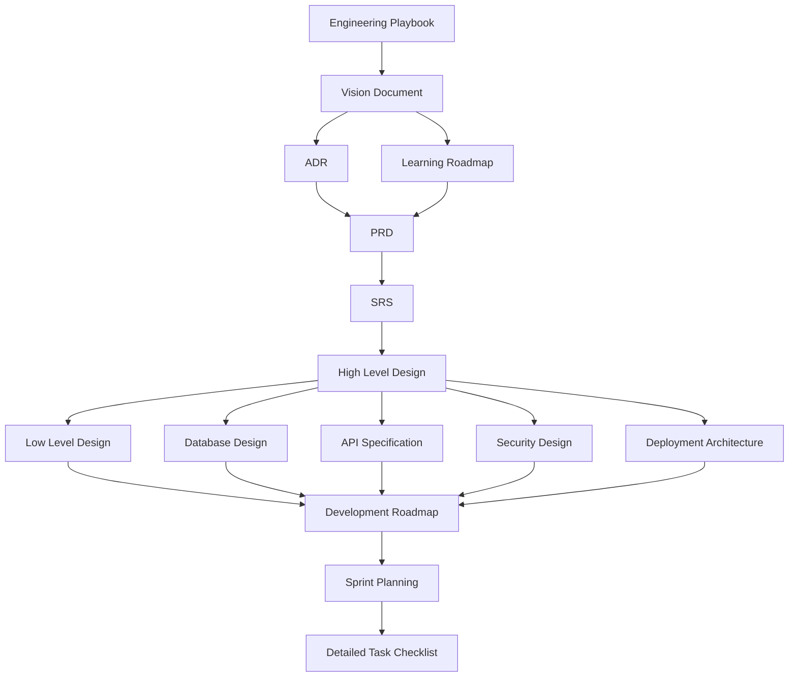

# Vision Document
## Project: Nexus — Discord-like Realtime Platform (Project-Based Learning)

**Dokumen:** Phase 0 — Vision Document
**Versi:** 1.0.0
**Status:** Draft — Menunggu Persetujuan
**Referensi Wajib:** `01-engineering-playbook.md` (v1.0.0)
**Klasifikasi:** Internal — Source of Truth

---

## 0. Posisi Dokumen Ini

Vision Document menjawab pertanyaan **"mengapa proyek ini ada, untuk siapa, dan seperti apa definisi berhasil"** — sebelum kita bicara *bagaimana* (itu ranah PRD/SRS/HLD di fase berikutnya).

Dokumen ini adalah **jangkar** yang akan terus dirujuk setiap kali muncul godaan menambah fitur atau kompleksitas yang tidak selaras dengan tujuan pembelajaran. Setiap kali muncul pertanyaan "apakah kita perlu X?", jawabannya divalidasi terhadap dokumen ini terlebih dahulu.

---

## 1. Latar Belakang & Masalah yang Dipecahkan

### 1.1 Masalah yang Sebenarnya Dipecahkan

Ini bukan proyek yang lahir dari kebutuhan bisnis nyata (tidak ada pengguna, tidak ada tekanan pasar). **Masalah yang dipecahkan adalah gap pembelajaran**: banyak materi software engineering mengajarkan konsep secara terisolasi (tutorial CRUD, tutorial WebSocket, tutorial Kubernetes) tanpa pernah menunjukkan **bagaimana konsep-konsep itu berinteraksi dalam satu sistem nyata yang berevolusi dari waktu ke waktu**.

Kelemahan spesifik yang ingin ditutup:

1. Kebanyakan tutorial menunjukkan microservices sebagai starting point, sehingga pembelajar tidak pernah merasakan **kapan dan mengapa** monolith mulai menyakitkan — akibatnya keputusan arsitektur diambil berdasarkan tren, bukan pemahaman trade-off.
2. Kebanyakan proyek belajar berhenti di "aplikasi jalan di localhost", tidak pernah menyentuh **production concern** sungguhan: graceful shutdown, zero-downtime deployment, observability, backpressure, race condition di production traffic.
3. Konsep seperti Outbox Pattern, Saga, Idempotency, Optimistic Locking sering dipelajari sebagai definisi abstrak, bukan dipraktikkan pada kasus konkret dengan konsekuensi nyata (mis. pesan duplikat terkirim, notifikasi hilang, race condition saat dua admin mengubah role bersamaan).

### 1.2 Mengapa Domain "Discord-like" Dipilih

Domain chat/komunikasi real-time dipilih secara sengaja (bukan e-commerce atau to-do list) karena **secara alami memaksa** eksplorasi hampir seluruh Learning Objective yang didefinisikan di Engineering Playbook:

- Realtime bidirectional communication → WebSocket, Presence, Typing Indicator.
- Data volume tinggi dengan pola akses time-series → pagination strategy, indexing, partitioning.
- Multi-tenancy alami (banyak workspace/server) → authorization model kompleks (Role/Permission per workspace).
- Kebutuhan konsistensi lintas domain (member join → butuh notifikasi, presence update, audit log) → domain event, eventual consistency, saga.
- Kebutuhan media besar (upload s.d. 1 GB, voice/video) → object storage, async processing, WebRTC/LiveKit, bottleneck CPU/bandwidth nyata untuk dipelajari.

Dengan kata lain: domain ini dipilih bukan karena "ingin membuat Discord", tapi karena domain ini adalah **kendaraan pedagogis** paling efisien untuk memaksa keputusan arsitektur yang realistis.

---

## 2. Vision Statement

> **Nexus adalah platform komunikasi real-time yang dibangun secara evolusioner — dari Modular Monolith menuju Full Microservices — untuk menjadi laboratorium hidup dalam memahami *mengapa* setiap pola arsitektur ada, kapan pola tersebut bernilai, dan kapan justru menjadi beban.**

Keberhasilan proyek ini **tidak diukur** dari:
- Jumlah fitur yang identik dengan Discord asli.
- Kesempurnaan UI/UX dibanding produk komersial.

Keberhasilan proyek ini **diukur** dari:
- Kemampuan menjelaskan, untuk setiap keputusan arsitektur yang diambil, apa alternatifnya, apa trade-off-nya, dan kapan keputusan itu akan direvisi.
- Kemampuan mendemonstrasikan evolusi arsitektur secara nyata dalam git history (bukan hanya diagram di atas kertas) — modul benar-benar berpindah dari monolith ke service terpisah, dengan bukti commit dan ADR.
- Sistem yang benar-benar bertahan terhadap kondisi production-like: graceful restart tanpa request gagal, recovery dari crash consumer tanpa kehilangan event, observability yang cukup untuk mendiagnosis masalah tanpa menebak.

---

## 3. Target Pengguna Dokumen Ini (Persona Pembelajaran)

Karena ini PBL, "pengguna" proyek ada dua lapis:

| Persona | Kebutuhan |
|---|---|
| **End-user aplikasi (fiktif/simulasi)** | Pengguna Discord-like biasa: chat, voice, video, notifikasi, pencarian. Direpresentasikan penuh di PRD. |
| **Pembelajar (Anda)** | Memahami *reasoning* di balik setiap keputusan, bukan hanya hasil akhir. Direpresentasikan lewat struktur dokumen ini dan seluruh fase berikutnya yang wajib menyertakan rationale. |

Seluruh dokumen di fase berikutnya harus melayani **kedua** persona ini secara eksplisit — PRD/SRS/HLD melayani persona pertama secara fungsional, namun narasi rationale di setiap dokumen melayani persona kedua.

---

## 4. Prinsip Pengambilan Keputusan (Decision Framework)

Setiap keputusan arsitektur/teknis dalam proyek ini harus lolos filter berikut, secara berurutan:

1. **Apakah ini menyelesaikan kebutuhan nyata di fase saat ini?** (YAGNI check — bukan "mungkin nanti dibutuhkan").
2. **Apakah ada solusi yang lebih sederhana dengan trade-off yang dapat diterima?** (Simplicity over Cleverness).
3. **Apakah keputusan ini punya learning value yang eksplisit terhadap Learning Objective di Engineering Playbook?** Jika tidak, pertimbangkan apakah perlu di-drop sepenuhnya dari scope.
4. **Apakah keputusan ini reversibel?** Keputusan yang mahal untuk dibalik (mis. pemilihan primary key strategy, event schema versioning strategy) mendapat kehati-hatian ekstra dan wajib melalui ADR resmi, bukan keputusan implisit dalam kode.

Filter ini adalah **cara berpikir arsitek** yang ingin ditanamkan sebagai kebiasaan, bukan sekadar aturan administratif untuk proyek ini saja.

---

## 5. Scope Filosofis: Apa yang SENGAJA Tidak Dikejar

Untuk menjaga fokus pembelajaran, proyek ini **secara sadar tidak mengejar**:

- **Feature parity penuh dengan Discord** (mis. Discord Nitro, Server Boost, Stage Channel kompleks, aplikasi bot marketplace) — fitur-fitur ini tidak menambah learning value arsitektur baru, hanya menambah permukaan implementasi.
- **Optimasi UI/animasi tingkat produk komersial** — cukup "semirip mungkin" secara struktural dan interaksi inti, bukan replika piksel-demi-piksel.
- **Multi-region active-active deployment sungguhan** — dipelajari secara konseptual di Deployment Architecture (Phase 8), tapi implementasi nyata dibatasi sesuai kapasitas infrastruktur yang realistis untuk proyek belajar (VPS/small cluster), bukan multi-datacenter sungguhan.
- **Native mobile app (iOS/Android)** — target eksplisit adalah Responsive Web + PWA, bukan aplikasi native, sesuai definisi target di awal.

Exclusion ini **wajib dirujuk kembali** bila di kemudian hari muncul dorongan menambah scope (*scope creep*) — jika sebuah usulan fitur tidak menambah nilai pembelajaran arsitektur baru, defaultnya adalah **tidak** dikerjakan, kecuali direvisi eksplisit di dokumen ini.

---

## 6. Kesuksesan Evolusi Arsitektur (Definition of Done per Fase)

Vision keseluruhan proyek adalah mencapai Phase D (Full Microservices), namun **setiap fase punya definisi selesai tersendiri** dan sah untuk "berhenti sementara" di fase manapun bila waktu belajar terbatas — tidak ada tekanan harus selalu lanjut ke fase berikutnya tanpa alasan.

| Fase | Definition of Done (ringkas) | Referensi Detail |
|---|---|---|
| A — Modular Monolith | Seluruh fitur inti (auth, workspace, channel, messaging dasar) berjalan dalam satu binary, boundary domain tegas (tidak ada cross-domain import langsung), deploy via Docker Compose | HLD Phase 3 |
| B — Event-Driven Monolith | Domain event penting (message created, member joined, dll.) dipublikasikan lewat Outbox Pattern, minimal 1 consumer asynchronous nyata (notifikasi) | HLD Phase 3, Event Catalog |
| C — Hybrid | Minimal 1 modul berhasil diekstraksi menjadi service independen, berkomunikasi balik ke monolith lewat REST/gRPC/Event, dengan CI/CD independen untuk service tersebut | Service Extraction Plan (bagian dari HLD) |
| D — Full Microservices | Seluruh modul yang direncanakan untuk diekstraksi (lihat urutan di Engineering Playbook/HLD) sudah berdiri sebagai service terpisah, dengan API Gateway, service-to-service auth, dan observability terpusat | HLD, Deployment Architecture Phase 8 |

**Rationale eksplisit:** setiap fase didefinisikan selesai secara independen agar proyek ini tetap punya nilai pembelajaran penuh walau berhenti di fase B atau C — mencerminkan kenyataan bahwa **banyak sistem produksi nyata sengaja tidak pernah mencapai Full Microservices**, dan itu adalah keputusan yang valid, bukan kegagalan.

---

## 7. Kapan TIDAK Perlu Lanjut ke Fase Arsitektur Berikutnya

Ini adalah bagian penting yang sering dilewatkan proyek belajar — kebiasaan "lanjut terus" tanpa mengevaluasi apakah lanjut memang perlu:

- **Tetap di Modular Monolith** bila: kompleksitas domain masih bisa dipahami satu orang penuh, deployment tunggal masih memenuhi kebutuhan skala saat ini, tidak ada tekanan tim/organisasi yang butuh independent deployability.
- **Tetap di Event-Driven Monolith (tidak lanjut ke Hybrid)** bila: kebutuhan asynchronous processing sudah terpenuhi dalam proses tunggal, belum ada kebutuhan nyata scaling independen per-domain (mis. notifikasi tidak perlu discale terpisah dari messaging).
- **Tetap di Hybrid (tidak lanjut Full Microservices)** bila: hanya 1-2 modul yang benar-benar butuh independensi (mis. Media/Voice karena beban CPU sangat berbeda dari domain lain), sisanya tetap efisien sebagai monolith — **ini justru sering menjadi arsitektur akhir yang paling rasional untuk skala menengah**, bukan sekadar batu loncatan.

Poin ini secara eksplisit menantang asumsi "microservices selalu tujuan akhir yang lebih baik" — bagian penting dari *learning value* proyek ini adalah memahami bahwa **Full Microservices adalah trade-off, bukan pencapaian**.

---

## 8. Keterkaitan dengan Dokumen Lain

Vision Document ini menjadi **filter validasi** untuk seluruh keputusan di ADR dan PRD — setiap fitur di PRD harus bisa ditelusuri balik ke salah satu Learning Objective atau kebutuhan fungsional persona end-user yang telah disepakati di sini.

---

## Ringkasan Keputusan

1. Domain "Discord-like" dipilih secara sengaja sebagai kendaraan pedagogis untuk memaksa eksplorasi hampir seluruh Learning Objective, bukan sebagai tujuan replikasi produk.
2. Kesuksesan proyek diukur dari kualitas reasoning arsitektur dan bukti evolusi nyata (git history, ADR), bukan dari feature parity atau kesempurnaan UI.
3. Setiap fase arsitektur (A-D) memiliki Definition of Done independen — proyek sah "berhenti" di fase manapun.
4. Scope secara eksplisit mengecualikan feature parity penuh, UI pixel-perfect, multi-region active-active sungguhan, dan native mobile app.
5. Decision Framework 4 langkah (YAGNI → Simplicity → Learning Value → Reversibility) menjadi filter wajib untuk seluruh keputusan teknis berikutnya.

## Trade-off yang Diterima

- Memilih domain kompleks (chat real-time) demi learning value maksimal berarti menerima kompleksitas implementasi awal yang lebih tinggi dibanding domain CRUD sederhana.
- Membiarkan proyek berpotensi "berhenti" di fase B/C (bukan wajib sampai D) berarti learning objective terkait Full Microservices (API Gateway aktif, service discovery, dsb.) berisiko tidak tercapai jika waktu terbatas — diterima karena filosofi "arsitektur adalah trade-off, bukan checklist yang harus dituntaskan".

## Risiko Arsitektur

- Risiko *scope creep* tetap ada mengingat domain Discord sangat luas secara fitur; mitigasi lewat §5 (exclusion list) dan Decision Framework §4.
- Risiko pembelajar (Anda) tergoda melompat langsung ke pola kompleks (event sourcing penuh, service mesh) sebelum kebutuhan nyata muncul — mitigasi lewat prinsip §7 (kapan TIDAK perlu lanjut).

## Technical Debt yang Sengaja Diterima

- Belum ada mekanisme formal untuk mengukur "apakah suatu fitur benar-benar menambah learning value" selain judgment kualitatif di setiap dokumen — akan diperkuat secara implisit lewat rationale di ADR dan PRD.

## Hal yang Perlu Dikonfirmasi Sebelum Lanjut ke Fase Berikutnya

1. Apakah **Vision Statement** di §2 sudah menangkap tujuan Anda secara akurat, atau ada penekanan lain yang ingin ditambahkan (mis. lebih menekankan performance engineering, atau lebih menekankan DX/tooling)?
2. Apakah **exclusion list** di §5 sudah sesuai — khususnya soal PWA-only (tanpa native mobile) dan tanpa multi-region sungguhan?
3. Apakah Anda setuju proyek ini **sah berhenti** di fase manapun (A/B/C) sesuai §7, atau Anda ingin proyek ini secara eksplisit ditargetkan **harus** mencapai Full Microservices sebagai definisi sukses akhir?
4. Lanjut ke dokumen **Architecture Decision Record (ADR)** berikutnya (masih Phase 0), atau ada revisi Vision Document ini dulu?

---

## Changelog

| Versi | Tanggal | Perubahan |
|---|---|---|
| 1.0.0 | Draft awal | Dokumen pertama, merujuk Engineering Playbook v1.0.0 yang telah disepakati |
