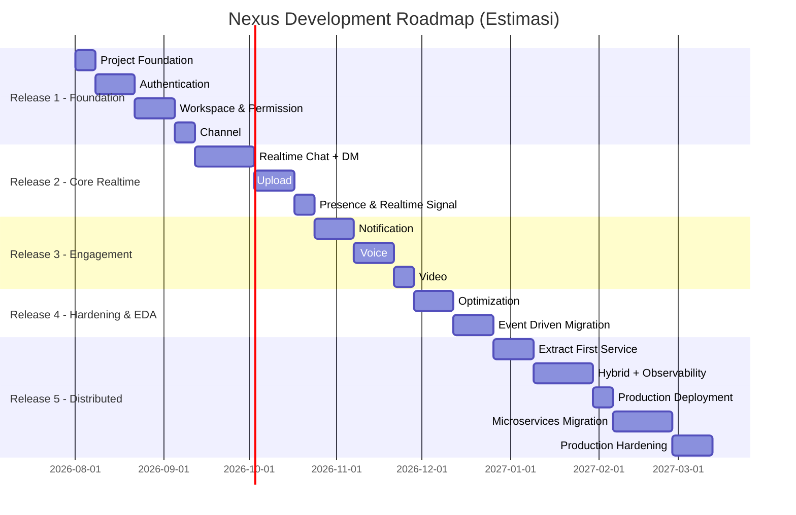

# Development Roadmap
## Project: Nexus — Discord-like Realtime Platform

**Dokumen:** Phase 9 — Development Roadmap
**Versi:** 1.0.0
**Status:** Draft — Menunggu Persetujuan
**Referensi Wajib:** `04-learning-roadmap.md`, `05-prd.md` (§10 Dependency), `07-hld.md` (§5 Service Extraction Plan), `12-deployment-architecture.md`
**Klasifikasi:** Internal — Source of Truth

---

## 0. Posisi Dokumen Ini

Learning Roadmap (Phase 0) mendefinisikan **apa yang dipelajari** per milestone. Dokumen ini menambahkan **estimasi waktu, urutan eksekusi presisi, dan definisi "selesai" yang dapat diverifikasi** — dasar langsung untuk Sprint Planning (Phase 10).

**Asumsi kapasitas belajar**: dikerjakan sebagai proyek individu/PBL dengan alokasi waktu paruh waktu (bukan full-time), estimasi dalam **minggu kalender**, bukan story point/man-days formal (tidak relevan untuk konteks solo learning).

---

## 1. Struktur Roadmap: 5 Rilis Besar (Release)

Development Roadmap dikelompokkan menjadi **5 Release**, masing-masing berakhir dengan sistem yang **benar-benar dapat di-demo end-to-end** — bukan sekadar checkpoint internal.

---

## 2. Detail per Release

### Release 1 — Foundation (± 6 minggu)

| Milestone (dari Learning Roadmap) | Estimasi | Definisi Selesai (Verifiable) |
|---|---|---|
| M1 Project Foundation | 1 minggu | `docker compose up` menjalankan skeleton lengkap (API + Web + PG + Redis + MinIO), CI hijau untuk PR kosong, health check endpoint merespons |
| M2 Authentication | 2 minggu | Register, login, refresh (dengan rotation), logout-all, session list berfungsi end-to-end dengan test otomatis lolos |
| M3 Workspace | 2 minggu | Buat workspace, invite, role custom, permission resolution (LLD §2.1) terverifikasi lewat test kasus multi-level override |
| M4 Channel | 1 minggu | CRUD channel seluruh tipe (kecuali voice/video belum fungsional penuh), permission override channel bekerja |

**Milestone Rilis**: Demo — user dapat register, membuat workspace, invite user lain, membuat channel teks (belum ada chat realtime).

### Release 2 — Core Realtime (± 6 minggu)

| Milestone | Estimasi | Definisi Selesai |
|---|---|---|
| M5 Realtime Chat + DM | 3 minggu | Kirim/edit/delete/reply/thread/mention/reaction berfungsi realtime via WebSocket; DM 1-on-1 & grup berfungsi dengan block enforcement |
| M6 Upload | 2 minggu | Upload hingga 1GB, validasi magic bytes, thumbnail generation asynchronous via Asynq terverifikasi |
| M7 Presence & Realtime Signal | 1 minggu | Status online/idle/dnd/invisible, typing indicator, read receipt berfungsi |

**Milestone Rilis**: Demo — chat penuh (termasuk DM) terasa seperti Discord dari sisi UX, attachment berfungsi.

### Release 3 — Engagement (± 5 minggu)

| Milestone | Estimasi | Definisi Selesai |
|---|---|---|
| M8 Notification | 2 minggu | Notifikasi realtime + email (Brevo) berfungsi dengan preferensi mute dan rate limiting batching |
| M9 Voice | 2 minggu | Join/leave voice channel via LiveKit, daftar partisipan realtime |
| M10 Video | 1 minggu | Perluasan LiveKit untuk video + screen share |

**Milestone Rilis**: Demo — seluruh fitur inti PRD (Must Priority) berfungsi, aplikasi terasa lengkap sebagai Discord-like.

### Release 4 — Hardening & Event-Driven Migration (± 4 minggu)

| Milestone | Estimasi | Definisi Selesai |
|---|---|---|
| M11 Optimization | 2 minggu | Load test mendekati target NFR awal, minimal 3 bottleneck teridentifikasi & diperbaiki dengan bukti before/after benchmark |
| M12 Event Driven | 2 minggu | Outbox Pattern aktif untuk minimal 3 domain event kunci (message, member, attachment), consumer idempotent terverifikasi lewat test retry |

**Milestone Rilis**: Sistem sudah **Event-Driven Modular Monolith** (Phase B arsitektur tercapai), performa tervalidasi data nyata.

### Release 5 — Distributed System (± 11 minggu, dapat berhenti di titik manapun sesuai Vision §7)

| Milestone | Estimasi | Definisi Selesai |
|---|---|---|
| M13 Extract First Service | 2 minggu | Minimal 1 service (Identity atau Notification) berjalan independen dengan database terpisah, CI/CD terpisah |
| M14 Hybrid Architecture | 3 minggu | Trace propagation lintas monolith↔service berfungsi (dapat ditelusuri di Grafana/Jaeger), API Gateway routing benar |
| M15 Observability | (paralel dengan M14, bukan sekuensial murni) | Dashboard Grafana RED method untuk seluruh service, alert dasar aktif |
| M16 Production Deployment | 1 minggu | Blue-Green switch teruji dengan load test paralel, zero request gagal saat switch |
| M17 Microservices Migration | 3 minggu | Sesuai Service Extraction Plan (HLD §5) — jumlah service final dievaluasi ulang saat milestone ini (bukan target tetap) |
| M18 Production Hardening | 2 minggu | Security review OWASP Top 10, disaster recovery drill berhasil, load test mendekati NFR penuh (10.000 concurrent user) |

**Milestone Rilis**: Sesuai Vision Document §6-7 — proyek **sah berhenti** di titik manapun dalam release ini bila Definition of Done fase arsitektur terkait sudah tercapai.

---

## 3. Total Estimasi & Fleksibilitas

**Total estimasi**: ± 32 minggu (~7-8 bulan) dari Release 1 hingga Release 5 selesai penuh — **estimasi kasar**, bukan komitmen kaku. Sesuai Vision Document §6-7, proyek tetap punya nilai pembelajaran penuh bila berhenti di akhir Release 4 (Event-Driven Modular Monolith) atau di tengah Release 5 (Hybrid).

**Titik Berhenti yang Valid** (checkpoint eksplisit, direferensikan dari Vision §6):

| Titik Berhenti | Setelah Release | Nilai Pembelajaran yang Sudah Tercapai |
|---|---|---|
| Minimum Viable Learning | Release 3 | Seluruh fitur produk + Clean Architecture + DDD Lite + WebSocket + Redis dasar |
| Solid Checkpoint | Release 4 | + Event-Driven Architecture penuh, Outbox Pattern, Optimization/Profiling |
| Distributed Checkpoint | Pertengahan Release 5 (M13-M15) | + Service Extraction nyata, Observability penuh, Hybrid Architecture |
| Full Target | Release 5 selesai | + Microservices penuh, Production Hardening |

---

## 4. Dependency Kritikal Antar Release

- Release 2 (Realtime Chat) **tidak dapat dimulai** sebelum Release 1 selesai penuh (Channel & Permission adalah prasyarat keras untuk otorisasi kirim pesan).
- Release 4 M12 (Event Driven) **sebaiknya tidak dimulai** sebelum M11 (Optimization) selesai — mengoptimasi monolith yang sudah solid lebih mudah diverifikasi dibanding mengoptimasi sistem yang sudah bercampur kompleksitas asynchronous (selaras Learning Roadmap M11 sebagai checkpoint wajib).
- Release 5 M17 (Microservices Migration) **bergantung** pada hasil nyata M13 (Extract First Service) — urutan Service Extraction Plan (HLD §5) divalidasi ulang berdasarkan pengalaman ekstraksi service pertama, bukan diikuti buta.

---

## Ringkasan Keputusan

1. Roadmap dikelompokkan menjadi **5 Release** yang masing-masing berujung pada sistem yang dapat di-demo end-to-end, bukan sekadar milestone internal.
2. Setiap milestone memiliki **Definisi Selesai yang dapat diverifikasi** (bukan "kelihatannya sudah jalan"), konsisten dengan Definition of Quality Playbook §8.
3. Titik berhenti valid didefinisikan eksplisit di 4 tingkat, menegaskan kembali prinsip Vision Document bahwa proyek tidak wajib mencapai Full Microservices untuk dianggap berhasil.

## Trade-off yang Diterima

- Total estimasi ±32 minggu adalah **kasar** dan akan meleset (baik lebih cepat maupun lebih lambat) — diterima karena proyek pembelajaran individu secara inheren sulit diestimasi presisi seperti proyek tim komersial.

## Risiko Arsitektur

- Release 5 memiliki risiko waktu paling tinggi meleset (kompleksitas distributed system secara inheren sulit diprediksi) — mitigasi: checkpoint eksplisit §3 memungkinkan proyek "berhasil" dihentikan tanpa menyelesaikan seluruh Release 5.

## Technical Debt yang Sengaja Diterima

- Estimasi waktu per milestone belum dipecah ke level task individual (itu adalah scope Sprint Planning Phase 10 dan Detailed Task Checklist Phase 11).

## Hal yang Perlu Dikonfirmasi Sebelum Lanjut ke Fase Berikutnya

1. Apakah struktur 5 Release dan estimasi kasar (±32 minggu total) dapat diterima sebagai kerangka acuan (bukan komitmen kaku)?
2. Apakah 4 titik berhenti valid (§3) sudah mewakili checkpoint yang bermakna bagi Anda?
3. Lanjut ke **Phase 10 — Sprint Planning**?

---

## Changelog

| Versi | Tanggal | Perubahan |
|---|---|---|
| 1.0.0 | Draft awal | Dokumen pertama Phase 9: 5 Release dengan estimasi waktu, Definisi Selesai per milestone, dan 4 titik berhenti valid |
