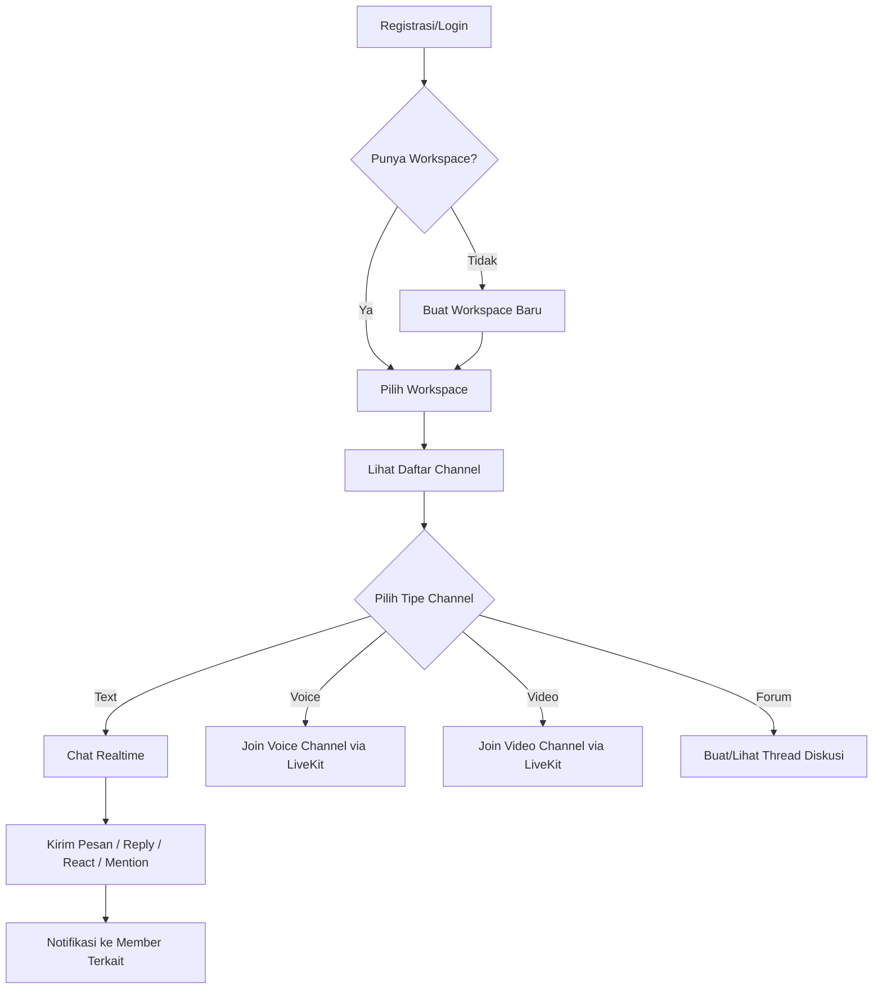
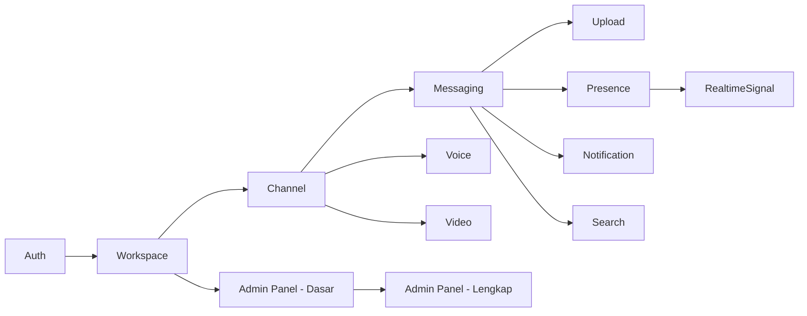

# Product Requirement Document (PRD)
## Project: Nexus — Discord-like Realtime Platform

**Dokumen:** Phase 1 — Product Requirement Document
**Versi:** 1.1.0
**Status:** Accepted (direvisi — Direct Message ditambahkan sebagai scope resmi)
**Referensi Wajib:** `01-engineering-playbook.md` (v1.0.0), `02-vision-document.md` (v1.0.0), `03-adr.md` (v1.1.0), `04-learning-roadmap.md` (v1.0.0)
**Klasifikasi:** Internal — Source of Truth

---

## 0. Posisi Dokumen Ini

PRD menjawab **"apa yang harus dibangun agar Vision tercapai"** — dari sini SRS (Phase 2) akan menerjemahkan setiap fitur menjadi requirement teknis presisi (format, batasan, kondisi error), dan HLD (Phase 3) akan menerjemahkan requirement menjadi desain sistem.

Setiap fitur di dokumen ini divalidasi terhadap **Decision Framework** (Vision §4) dan **Exclusion List** (Vision §5) — bila sebuah fitur tidak lolos filter tersebut, ia tidak dimasukkan meski ada di aplikasi Discord asli.

---

## 1. Executive Summary

Nexus adalah platform komunikasi real-time berbasis workspace (server) dengan channel bertipe teks, suara, video, forum, dan pengumuman. Produk ini menargetkan pengalaman inti Discord — komunitas terorganisir dalam server, percakapan real-time, voice/video, dan notifikasi — tanpa mengejar fitur non-esensial yang tidak menambah nilai pembelajaran arsitektur (lihat Vision §5).

---

## 2. Tujuan Produk (Goals)

| # | Goal | Terhubung ke |
|---|---|---|
| G1 | Pengguna dapat membentuk komunitas (workspace) dengan struktur kanal dan role yang fleksibel | Domain Workspace, Role, Permission |
| G2 | Pengguna dapat berkomunikasi real-time lewat teks, suara, dan video tanpa terasa lag | Domain Message, Voice, Video, Presence |
| G3 | Pengguna mendapat notifikasi relevan tanpa merasa spam | Domain Notification |
| G4 | Pengguna dapat menemukan kembali percakapan/berkas lama dengan mudah | Domain Search |
| G5 | Administrator platform memiliki kontrol dan visibilitas atas kesehatan & keamanan sistem | Domain Admin |
| G6 | Sistem tetap responsif dan stabil pada skala 10.000 concurrent users dan 100.000 member/server | NFR (detail SRS Phase 2) |

## 3. Non-Goals (Tegas Tidak Dikejar)

Mengacu langsung ke Vision Document §5 — dicantumkan ulang di sini agar PRD dapat dibaca berdiri sendiri:

- Feature parity penuh dengan Discord (Nitro, Server Boost, Stage Channel kompleks, bot marketplace).
- Native mobile application (iOS/Android) — target adalah Responsive Web + PWA.
- Multi-region active-active deployment sungguhan.
- UI pixel-perfect identik Discord — cukup mirip secara struktural & interaksi inti.

---

## 4. Target Persona

| Persona | Deskripsi | Kebutuhan Utama |
|---|---|---|
| **Member** | Pengguna biasa dalam satu/banyak workspace | Chat cepat, voice/video jernih, notifikasi relevan, pencarian mudah |
| **Moderator** | Member dengan permission mengelola channel/member di workspace tertentu | Kontrol atas konten (hapus pesan, kick member), audit log aksi moderasi |
| **Workspace Owner** | Pembuat/pemilik workspace | Kontrol penuh role/permission/kategori/channel, invite management |
| **Platform Admin** | Administrator sistem secara keseluruhan (lintas workspace) | Visibilitas kesehatan sistem, moderasi lintas workspace, manajemen user tingkat platform |

---

## 5. Feature Overview & Prioritas (MoSCoW)

Prioritas dipetakan terhadap Milestone di Learning Roadmap agar urutan development (Phase 9 Development Roadmap) dapat langsung dirujuk dari sini.

| Fitur | Prioritas | Milestone Terkait |
|---|---|---|
| Authentication (Register/Login email & username) | **Must** | M2 |
| Workspace, Role, Permission, Category | **Must** | M3 |
| Channel (Text, Voice, Video, Forum, Announcement) | **Must** | M4, M9, M10 |
| Messaging inti (kirim, edit, delete, soft delete, markdown) | **Must** | M5 |
| Messaging lanjutan (reply, thread, mention, reaction) | **Must** | M5 |
| Messaging embed | **Should** | M5 |
| Messaging poll | **Could** | M5 (opsional, dibahas di §6.4.7) |
| Upload attachment (image, video, audio, PDF, ZIP hingga 1GB) | **Must** | M6 |
| Presence (online/offline/idle/DND/invisible) | **Must** | M7 |
| Realtime signal (typing indicator, read receipt) | **Must** | M5, M7 |
| Notification (realtime + email) | **Must** | M8 |
| Search (server, channel, user, message, attachment) | **Must** | M4 (foundation), fase lanjut setelah data cukup |
| Admin Panel | **Must** | M18 (matang penuh), namun fondasi dasar dibangun paralel sejak M3 |
| **Direct Message (DM) personal antar user** | **Must** | M5 (diperluas dari domain Message, dengan model channel privat 1-on-1/grup kecil) |

**Rationale prioritas Poll sebagai "Could"**: Poll bukan bagian dari kebutuhan komunikasi inti (chat, voice, video) dan tidak menambah Learning Objective arsitektur baru dibanding fitur messaging lain — sesuai Decision Framework Vision §4 poin 3 (learning value check), fitur ini boleh ditunda/diskip tanpa mengurangi esensi proyek.

---

## 6. Detail Requirement per Fitur

Setiap requirement ditulis dalam format **User Story + Priority + Acceptance Criteria (tingkat tinggi — detail presisi lengkap ada di SRS Phase 2)**.

### 6.1 Authentication

**US-AUTH-01**: Sebagai pengguna baru, saya ingin mendaftar dengan email, username, dan password, agar saya punya identitas di Nexus.
- Priority: Must
- AC: Validasi format email, keunikan username & email, password memenuhi kebijakan minimum (detail di Security Design Phase 7), password di-hash Argon2id sebelum disimpan (ADR — Milestone 2).

**US-AUTH-02**: Sebagai pengguna terdaftar, saya ingin login dengan email **atau** username beserta password, agar saya fleksibel memakai kredensial yang saya ingat.
- Priority: Must
- AC: Login gagal memberi pesan generik ("kredensial tidak valid") tanpa membocorkan apakah email/username terdaftar (mitigasi user enumeration).

**US-AUTH-03**: Sebagai pengguna yang login, saya ingin sesi saya tetap aktif tanpa perlu login ulang setiap beberapa menit, namun tetap aman bila device saya hilang.
- Priority: Must
- AC: Access token berumur pendek, refresh token rotasi tiap pemakaian, mendukung "logout dari semua device" (revoke seluruh refresh token milik user).

**US-AUTH-04**: Sebagai pengguna, saya ingin melihat dan mengelola device/sesi aktif saya (Device Management, sesuai NFR).
- Priority: Should

### 6.2 Workspace, Role, Permission, Category

**US-WS-01**: Sebagai pengguna, saya ingin membuat workspace baru, agar saya dapat memulai komunitas saya sendiri.
- Priority: Must
- AC: Pembuat otomatis menjadi Owner dengan seluruh permission; workspace mendapat ID unik dan invite code default.

**US-WS-02**: Sebagai Workspace Owner, saya ingin membuat role kustom dengan kombinasi permission tertentu, agar saya dapat mendelegasikan tanggung jawab tanpa memberi akses penuh.
- Priority: Must
- AC: Role dapat di-assign ke banyak member; urutan hierarki role menentukan resolusi konflik (role lebih tinggi menang, detail resolusi di LLD).

**US-WS-03**: Sebagai Workspace Owner/Admin, saya ingin mengelompokkan channel ke dalam kategori, agar struktur workspace tetap rapi saat channel bertambah banyak.
- Priority: Must

**US-WS-04**: Sebagai member, saya ingin bergabung ke workspace lewat kode invite atau tautan, agar saya dapat berpartisipasi dalam komunitas.
- Priority: Must
- AC: Invite dapat dibatasi (jumlah pemakaian, masa berlaku); mendukung idempotency (redeem invite yang sama dua kali tidak menghasilkan duplikasi membership — lihat §17.4 Engineering Playbook).

**US-WS-05**: Sebagai member dengan permission tertentu, saya ingin mengatur permission override khusus untuk channel tertentu (berbeda dari default role), agar saya dapat membuat channel privat dalam workspace publik.
- Priority: Must

### 6.3 Channel

**US-CH-01**: Sebagai member dengan permission, saya ingin membuat channel teks, agar anggota dapat berdiskusi topik tertentu.
- Priority: Must

**US-CH-02**: Sebagai member, saya ingin membuat/bergabung channel suara, agar saya dapat berbicara langsung dengan anggota lain.
- Priority: Must
- AC: Channel suara menampilkan daftar partisipan aktif secara realtime.

**US-CH-03**: Sebagai member, saya ingin membuat/bergabung channel video, agar saya dapat melakukan panggilan video/screen share.
- Priority: Must

**US-CH-04**: Sebagai member, saya ingin berdiskusi dalam format forum (thread per topik), agar diskusi panjang tidak bercampur dalam satu aliran linear.
- Priority: Should

**US-CH-05**: Sebagai Workspace Owner/Moderator, saya ingin membuat channel pengumuman yang hanya bisa diposting role tertentu namun dapat dilihat semua member, agar informasi penting tersampaikan tanpa noise diskusi.
- Priority: Should

### 6.4 Messaging

**US-MSG-01**: Sebagai member, saya ingin mengirim pesan teks dengan format markdown, agar saya dapat menekankan/memformat pesan saya.
- Priority: Must

**US-MSG-02**: Sebagai member, saya ingin membalas (reply) pesan tertentu, agar konteks percakapan yang saya rujuk jelas.
- Priority: Must

**US-MSG-03**: Sebagai member, saya ingin membuat thread dari sebuah pesan, agar diskusi cabang tidak mengganggu aliran utama channel.
- Priority: Must

**US-MSG-04**: Sebagai member, saya ingin menyebut (mention) pengguna/role tertentu, agar yang bersangkutan mendapat notifikasi.
- Priority: Must

**US-MSG-05**: Sebagai member, saya ingin memberi reaksi emoji pada pesan, agar saya dapat merespons cepat tanpa mengirim pesan baru.
- Priority: Must

**US-MSG-06**: Sebagai member, saya ingin mengedit pesan saya sendiri, agar saya dapat memperbaiki kesalahan tanpa mengirim ulang.
- Priority: Must
- AC: Pesan yang diedit menampilkan indikator "(diedit)"; histori edit tidak wajib ditampilkan ke user (dicatat internal untuk audit bila diperlukan).

**US-MSG-07**: Sebagai member, saya ingin menghapus pesan saya sendiri (atau Moderator menghapus pesan siapapun), agar konten tidak diinginkan dapat dibersihkan.
- Priority: Must
- AC: Soft delete (pesan ditandai terhapus, tidak benar-benar dihapus dari database untuk kebutuhan audit — konsisten dengan konvensi `deleted_at` di Engineering Playbook §7.6).

**US-MSG-08**: Sebagai member, saya ingin melihat preview embed (link dengan thumbnail/deskripsi), agar konten yang dibagikan lebih informatif.
- Priority: Should

**US-MSG-09**: Sebagai member, saya ingin membuat polling sederhana dalam channel, agar keputusan komunitas dapat diambil secara terstruktur.
- Priority: **Could** (lihat rationale prioritas di §5)

### 6.5 Presence & Realtime Signal

**US-PRES-01**: Sebagai member, saya ingin melihat status online/idle/DND/offline anggota lain, agar saya tahu siapa yang dapat diajak bicara saat ini.
- Priority: Must

**US-PRES-02**: Sebagai member, saya ingin menyembunyikan status saya (invisible), agar saya dapat menggunakan aplikasi tanpa terlihat online oleh orang lain.
- Priority: Should

**US-RT-01**: Sebagai member, saya ingin melihat indikator "sedang mengetik" saat lawan bicara mengetik, agar percakapan terasa lebih hidup.
- Priority: Must

**US-RT-02**: Sebagai member, saya ingin tahu apakah pesan saya sudah dibaca (read receipt), agar saya tahu status percakapan saya.
- Priority: Should

### 6.6 Notification

**US-NOTIF-01**: Sebagai member, saya ingin menerima notifikasi realtime saat disebut (mention) atau menerima pesan langsung, agar saya tidak melewatkan percakapan penting.
- Priority: Must

**US-NOTIF-02**: Sebagai member yang sedang offline, saya ingin menerima ringkasan notifikasi via email, agar saya tetap terinformasi meski tidak membuka aplikasi.
- Priority: Should

**US-NOTIF-03**: Sebagai member, saya ingin mengatur preferensi notifikasi per channel/workspace (mute), agar saya tidak terganggu notifikasi yang tidak relevan.
- Priority: Must

### 6.7 Upload

**US-UP-01**: Sebagai member, saya ingin mengunggah gambar/video/audio/PDF/ZIP hingga 1 GB sebagai lampiran pesan, agar saya dapat berbagi berkas dengan mudah.
- Priority: Must
- AC: Validasi tipe file berdasarkan konten aktual (bukan ekstensi semata — lihat Learning Roadmap M6), progress upload ditampilkan ke user, file besar diproses asynchronous (thumbnail/transcoding) tanpa memblokir pengiriman pesan.

### 6.8 Search

**US-SRCH-01**: Sebagai member, saya ingin mencari pesan berdasarkan kata kunci dalam channel/workspace, agar saya dapat menemukan kembali informasi lama.
- Priority: Must

**US-SRCH-02**: Sebagai member, saya ingin mencari user/channel/server berdasarkan nama, agar saya dapat menavigasi workspace besar dengan cepat.
- Priority: Must

**US-SRCH-03**: Sebagai member, saya ingin mencari attachment (nama file/tipe), agar saya dapat menemukan berkas yang pernah dibagikan.
- Priority: Should

### 6.9 Direct Message (DM)

> **Catatan amandemen (v1.1.0)**: Fitur ini semula ambigu di draft awal (dicatat sebagai klarifikasi di SRS §6) dan telah dikonfirmasi **masuk scope resmi**.

**US-DM-01**: Sebagai member, saya ingin mengirim pesan langsung (1-on-1) ke user lain di luar konteks workspace/channel manapun, agar saya dapat berkomunikasi privat.
- Priority: Must
- AC: DM dimodelkan sebagai "private channel" antara 2 (atau lebih, untuk grup DM) user tanpa keterikatan ke workspace manapun — memakai struktur data Channel yang sama (tipe baru: `dm`) agar tidak menduplikasi logika Messaging (reply/thread/reaction/edit/delete tetap berlaku sama).

**US-DM-02**: Sebagai member, saya ingin membuat grup DM dengan beberapa user (bukan hanya 1-on-1), agar saya dapat berdiskusi privat dengan beberapa teman tanpa membuat workspace baru.
- Priority: Should
- AC: Grup DM dibatasi jumlah partisipan maksimal (nilai final di SRS/LLD, mis. 10 partisipan) untuk membedakan dari Workspace yang memang didesain untuk skala besar.

**US-DM-03**: Sebagai member, saya ingin memblokir user tertentu agar tidak dapat mengirim DM ke saya, agar saya terlindungi dari pesan yang tidak diinginkan.
- Priority: Must
- AC: User yang diblokir tidak dapat memulai DM baru maupun mengirim pesan ke DM yang sudah ada dengan user yang memblokir.

**Rationale desain**: DM **tidak dijadikan domain terpisah** dari Message/Channel — DM adalah variasi tipe Channel (`dm`) tanpa `workspace_id` (nullable), memanfaatkan seluruh infrastruktur Messaging yang sudah ada (reply, thread, reaction, edit, delete, upload attachment, search). Ini konsisten dengan prinsip DRY dan menghindari duplikasi logika bisnis yang identik.

### 6.10 Admin Panel

**US-ADM-01**: Sebagai Platform Admin, saya ingin melihat dashboard kesehatan sistem (jumlah user aktif, error rate, resource usage), agar saya dapat memantau kondisi platform.
- Priority: Must

**US-ADM-02**: Sebagai Platform Admin, saya ingin mengelola user tingkat platform (suspend, ban), agar saya dapat menegakkan kebijakan penggunaan.
- Priority: Must

**US-ADM-03**: Sebagai Platform Admin, saya ingin melihat audit log aksi sensitif (perubahan role, penghapusan workspace, dsb.), agar saya dapat menyelidiki insiden bila terjadi.
- Priority: Must

---

## 7. Alur Pengguna Utama (High-Level User Flow)

---

## 8. Non-Functional Requirement (Ringkasan — Detail di SRS Phase 2)

Merujuk langsung ke instruksi awal proyek, dirangkum di sini sebagai target tingkat tinggi:

- Target skala: 10.000 concurrent users, 100.000 member/server, unlimited channel (dengan pagination & optimisasi).
- Response time, availability target, disaster recovery, backup strategy, rate limiting, audit log, device management, enkripsi, CSP, CSRF, spam protection — seluruhnya dijabarkan presisi di **SRS (Phase 2)** dan **Security Design (Phase 7)**, tidak diulang di sini agar PRD tetap fokus pada *apa*, bukan *seberapa presisi*.

---

## 9. Asumsi & Batasan (Assumptions & Constraints)

- Infrastruktur pengembangan/produksi menggunakan VPS/small cluster, bukan multi-datacenter cloud provider besar (konsisten dengan Vision §5 exclusion multi-region).
- Volume attachment dan storage MinIO dikelola sendiri; kapasitas disk perlu direncanakan proporsional dengan NFR (dibahas di Deployment Architecture Phase 8).
- Email untuk notifikasi memerlukan SMTP provider/relay — detail provider dipilih di SRS/HLD (belum diputuskan di dokumen ini, dicatat sebagai item konfirmasi).

---

## 10. Dependency Antar Fitur (Urutan Pembangunan Wajib)

**Rationale:** Search bergantung pada volume data Messaging (tidak ada gunanya membangun full-text search sebelum ada data pesan untuk dicari); Admin Panel dibangun dua tahap (dasar sejak Workspace, lengkap setelah Observability matang di Milestone 15/18) — konsisten dengan Learning Roadmap.

---

## Ringkasan Keputusan

1. Prioritas fitur dipetakan eksplisit ke Milestone Learning Roadmap agar Development Roadmap (Phase 9) dapat langsung dirujuk tanpa re-derivasi.
2. **Poll** diturunkan prioritasnya menjadi "Could" karena tidak menambah Learning Objective arsitektur baru — konsisten dengan Decision Framework Vision §4.
3. Dependency antar fitur eksplisit didefinisikan (§10) untuk memastikan urutan pembangunan logis, terutama Search yang butuh data Messaging matang terlebih dahulu.

## Trade-off yang Diterima

- Beberapa fitur "Should"/"Could" (embed, poll, read receipt, invisible status) berpotensi ditunda bila waktu belajar terbatas — diterima karena tidak mengorbankan Learning Objective inti.

## Risiko Arsitektur

- Search (full-text PostgreSQL) berpotensi menjadi bottleneck pada volume pesan sangat besar tanpa strategi indexing yang tepat — akan dianalisis mendalam di Database Design (Phase 5) dan dipertimbangkan sebagai kandidat ekstraksi service (sudah diantisipasi di urutan Service Extraction Plan draft: Identity → Notification → Presence → Media → Search → ...).
- Belum ada keputusan SMTP provider untuk email notification — perlu dikonfirmasi sebelum SRS/HLD detail notification ditulis.

## Technical Debt yang Sengaja Diterima

- Detail acceptance criteria presisi (format request/response, validasi field-level) sengaja tidak dijabarkan di PRD ini — akan dituntaskan di SRS (Phase 2) dan API Specification (Phase 6), agar PRD tetap terbaca sebagai dokumen kebutuhan produk, bukan spesifikasi teknis.

## Hal yang Perlu Dikonfirmasi Sebelum Lanjut ke Fase Berikutnya

1. Apakah prioritas MoSCoW di §5 (khususnya penurunan **Poll** menjadi "Could" dan **Embed/Read Receipt/Invisible Status** menjadi "Should") dapat diterima?
2. Apakah persona **Platform Admin** terpisah dari **Workspace Owner** sudah sesuai model mental Anda tentang Admin Panel?
3. Provider SMTP untuk email notification — apakah ada preferensi (mis. self-hosted Postfix, atau layanan seperti SMTP relay pihak ketiga), atau serahkan keputusan ke saya di HLD/SRS nanti?
4. Lanjut ke **Phase 2 — Software Requirement Specification (SRS)**?

---

## Changelog

| Versi | Tanggal | Perubahan |
|---|---|---|
| 1.0.0 | Draft awal | Dokumen pertama Phase 1, merujuk penuh ke seluruh dokumen Phase 0 yang telah disepakati |
| 1.1.0 | Revisi | Ditambahkan §6.9 Direct Message (DM) sebagai scope resmi (US-DM-01/02/03), menyelesaikan ambiguitas yang dilaporkan SRS §6. `workspace_id` pada Channel dikonfirmasi nullable untuk mendukung tipe `dm`. |
